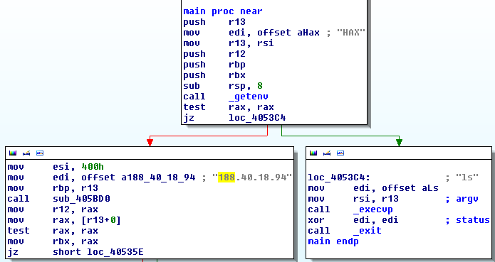
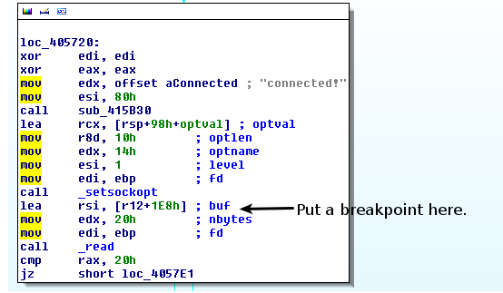
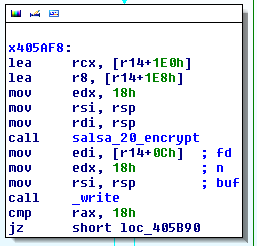

# 31C3 CTF 2014: ls

**Category:** malware
**Points:** 25
**Solves:** 14
**Description:**

> We found [this](ls) binary and [captured](ls.pcap) some traffic…

## Write-up

I started off with inspecting the captured traffic which looked like a tcp connection to 188.40.18.94 sending some binary data back and forth. I couldn’t really make anything from it.

So off to the binary. Looking at the main function in IDA we immediately see two branches:



If the environment variable `HAX` exists the program executes `sub_405BD0("188.40.18.94", 1024)` which seems to be setting up a connection to the IP address also found in the `pcap`. Running a quick `strace` we confirm that it indeed makes this connection:

```bash
$ export HAX=hax
$ strace ./ls
	...
	socket(PF_INET, SOCK_STREAM, IPPROTO_TCP) = 6
	connect(6, {sa_family=AF_INET, sin_port=htons(1024), sin_addr=inet_addr("188.40.18.94")}, 16) = 0
	...
```

During this strace I also noticed the program then just blocks and waits (using `epoll_wait`) until I pressed a key. When a key was pressed something was read and then written to the TCP socket.

Since the challenge category was ‘malware’ I assumed it was some sort of keylogger which sent the keylogged data to the hacker machine at 188.40.18.94.

Next I ran `ltrace` on the program in which I noticed the program also looks for the `G_DEBUG` environment variable which ment the program was probably spitting out some debug messages using `glib`. So I ran the program with `G_MESSAGES_DEBUG=all`:

```bash
$ G_MESSAGES_DEBUG=all ./ls
	** (process:3600): DEBUG: connected!
	** (process:3600): DEBUG: key initialized!
	** (process:3600): DEBUG: attaching '/dev/input/by-path/pci-0000:00:1d.0-usb-0:1.6.1:1.0-event-kbd'
	** (process:3600): DEBUG: attaching '/dev/input/by-path/platform-i8042-serio-0-event-kbd'
```

This pretty much confirmed my assumption of the program being a keylogger: it attaches itself to `/dev/input/by-path/platform-i8042-serio-0-event-kbd` from which my keyboard input events can be read.

The program also mentions something about a key being initialized after the TCP connection being made. I went to look for this string in IDA which was at subroutine `sub_4055E0`. This subroutine basically does two things: first it sets up the TCP connection to 188.40.18.94:1024. Next it reads 32 bytes from this connection and uses them as the ‘key’. My first thought here was that the key was probably used to encrypt the traffic to the server.

Next I took the following steps:

- Load the program in `gdb` and put a breakpoint where the key is being initialized.
- Find out the address of the key (buf in the screenshot below).
- Put a read watchpoint (`rwatch *buf` in `gdb`) on this address to find out where the key is being used



The key was being used in at address `0x43afb1` which was part of the subroutine `sub_43AEA0` so I assumed this was the encryption method.

After looking at this method I was ready to give up. The method is a giant clutter of assembly instructions.

However I kept digging trough it with gdb and noticed the `r8` registry contained the `2-by` string which was rater interesting. I traced this back to `0x43B00E` which had the following instructions:

```
mov     rdx, 61707865h
mov     rcx, 3320646Eh
mov     r8, 79622D32h
mov     rax, 6B206574h
```

The string `expand 32-byte k` was being loaded in those 4 registers. A quick Google search revealed that this string was used in [the Salsa20 encryption library](http://cr.yp.to/snuffle/salsa20/merged/salsa20.c).

I also found this great [Python Salsa20 library](https://github.com/keybase/python-salsa20) which we’ll use later.

So putting this together I assumed the program flow was as follows:

- Make a connection to 188.40.18.94:1024.
- Capture all key events and encrypt them using Salsa20 with a key received by the server.
- Send the encrypted events to the server.

However, to encrypt/decrypt using Salsa20 a nonce is also needed. Looking back at the binary where the Salsa20 encrypt is being called we see a couple of parameters:



- `rsi` contains pointer to key event data (`=rsp`)
- `rdi` contains pointer to where the encrypted key event data will be stored (`=rsp`)
- `rdx`/`edx` contains length of data to encrypt (`= 0x18`)
- `r8` contains the pointer to the key
- `rcx` which is the only one left over, this must be the nonce then!

I then put a breakpoint right before the encryption to find out the nonce. It seemed like it started at `0` and then got increased by `1` for every encryption.

Putting all the findings together we can create a Python script using the previously mentioned library to decrypt the data in the pcap!

After the events are encrypted all that’s left to do is to parse the key events and extract what the victim was typing.

Some Googling revealed that the key events are stored in a struct:

```c
struct input_event {
	struct timeval time;
	__u16 type;
	__u16 code;
	__s32 value;
};
```

Additionally I used the `evdev` Python module to replay the events to make my computer actually type out the flag.

The script to do all this can be found [here](decrypt.py).

Running this made my computer type out the flag: `31C3_7yp3_s4f3ty!1`.

## Other write-ups and resources

* <http://tasteless.eu/2014/12/31c3-ctf-ls-writeup/>
