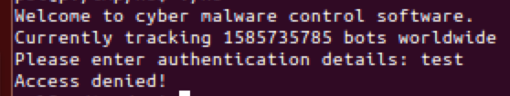
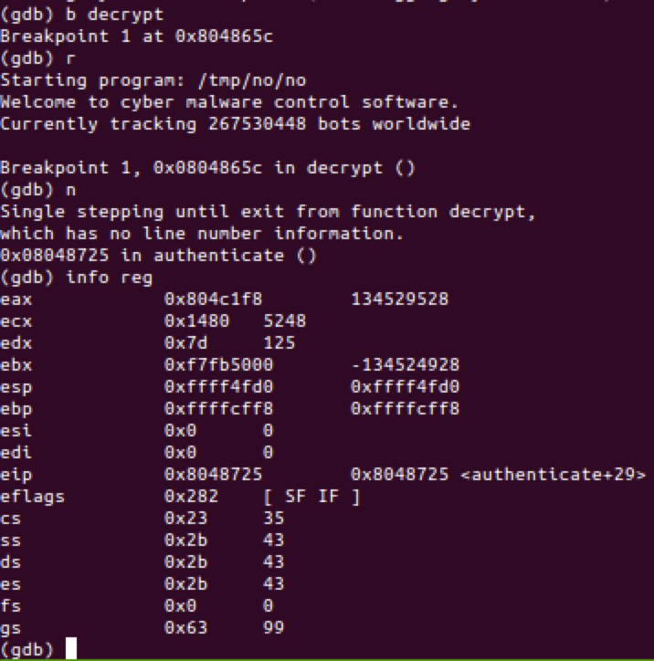
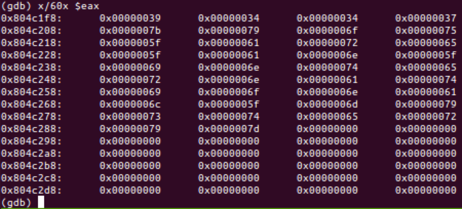

# 9447 CTF 2014: no strings attached

**Category:** Reversing
**Points:** 25
**Solves:** 166
**Description:**

> [`no_strings_attached`](no_strings_attached)

## Write-up

We are given an Intel 32-bit executable, not stripped.

Running the binary yields following prompt and requests us for an authentification code:



We can decompile the code in Intel syntax using `objdump -D -M intel no_strings_attached` and find the main calling a suspicious function, `authenticate`:


```nasm
080487a9 <main>:
 80487a9:	55                   	push   ebp
 80487aa:	89 e5                	mov    ebp,esp
 80487ac:	83 e4 f0             	and    esp,0xfffffff0
 80487af:	83 ec 10             	sub    esp,0x10
 80487b2:	c7 44 24 04 e4 8b 04 	mov    DWORD PTR [esp+0x4],0x8048be4
 80487b9:	08 
 80487ba:	c7 04 24 06 00 00 00 	mov    DWORD PTR [esp],0x6
 80487c1:	e8 7a fd ff ff       	call   8048540 <setlocale@plt>
 80487c6:	e8 39 fe ff ff       	call   8048604 <banner>
 80487cb:	e8 73 fe ff ff       	call   8048643 <prompt_authentication>
 80487d0:	e8 33 ff ff ff       	call   8048708 <authenticate> ; <----
 80487d5:	b8 00 00 00 00       	mov    eax,0x0
 80487da:	c9                   	leave  
 80487db:	c3                   	ret 
```

This `authenticate` later calls a `decrypt` function:

```nasm
08048708 <authenticate>:
 8048708:	55                   	push   ebp
 8048709:	89 e5                	mov    ebp,esp
 804870b:	81 ec 28 80 00 00    	sub    esp,0x8028
 8048711:	c7 44 24 04 90 8a 04 	mov    DWORD PTR [esp+0x4],0x8048a90
 8048718:	08 
 8048719:	c7 04 24 a8 8a 04 08 	mov    DWORD PTR [esp],0x8048aa8
 8048720:	e8 33 ff ff ff       	call   8048658 <decrypt> ; <----
 8048725:	89 45 f4             	mov    DWORD PTR [ebp-0xc],eax
```
Let's jump to the state after the `decrypt` function call using `gdb`!



Since return values and pointers to memory, where values are located, is saved in the EAX register - as by [x86 C convention](http://en.wikibooks.org/wiki/X86_Disassembly/Calling_Conventions#CDECL), it is always a good guess to look at the content of this register:



The content looks like a hexadecimal ASCII string, let's extract it and convert it to a readable character string:


```
$ echo '393434377b796f755f6172655f616e5f696e7465726e6174696f6e616c5f6d7973746572797d' | gsed 's/\\x//g' | xxd -r -p
9447{you_are_an_international_mystery}
```

The flag is `9447{you_are_an_international_mystery}`.

## Other write-ups and resources

* <http://theevilbit.blogspot.com/2014/12/9447-ctf-2014-writeup-reversing-125100.html>
* <https://github.com/pwning/public-writeup/blob/master/9447ctf2014/reversing/no_strings_attached/no_strings_attached.md>
