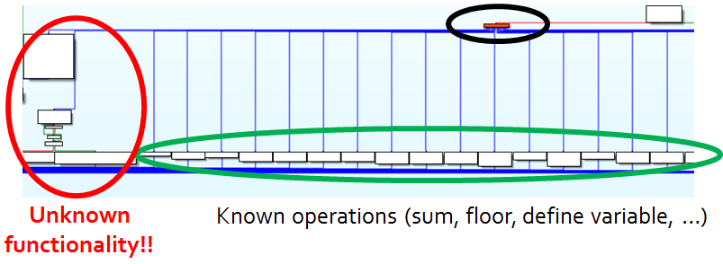

# ASIS Cyber Security Contest Finals 2014: ASIS calc

**Category:** Reverse
**Points:** 250
**Description:**

> Download the [file](ASIScalc_c4b96a8c1eb9d0881f0c599456d0fceb) and find the flag.

## Write-up

Let’s see what [the provided file](ASIScalc_c4b96a8c1eb9d0881f0c599456d0fceb) could be:

```bash
$ file ASIScalc_c4b96a8c1eb9d0881f0c599456d0fceb
ASIScalc_c4b96a8c1eb9d0881f0c599456d0fceb: xz compressed data
```

So, we extract the file using the built-in `xz` or `unxz` commands:

* `xz -dc < ASIScalc_c4b96a8c1eb9d0881f0c599456d0fceb > calc`
* `unxz < ASIScalc_c4b96a8c1eb9d0881f0c599456d0fceb > calc`

Alternatively, extract the provided file using [p7zip](http://p7zip.sourceforge.net/):

```bash
7z x ASIScalc_c4b96a8c1eb9d0881f0c599456d0fceb
```

Let’s find out what the extracted file is:

```bash
$ file calc
calc: ELF 64-bit LSB executable, x86-64, version 1 (SYSV), dynamically linked (uses shared libs), for GNU/Linux 2.6.32, stripped
```

We were able to get this executable running on a Debian 8 installation. Let’s explore it:

```bash
$ ./calc
(1+3)*10
40
floor(33.333)
syntax error
sqrt(91)
9.53939
!@#$%^&*()_)(*&^%$#@![];'/.
Unrecognized character: !
Unrecognized character: @
Unrecognized character: #
Unrecognized character: $
syntax error
Unrecognized character: _
Unrecognized character: $
Unrecognized character: #
Unrecognized character: @
Unrecognized character: !
Unrecognized character: [
Unrecognized character: ]
Unrecognized character: ;
Unrecognized character: '
Unrecognized character: .
```

So it’s a real calculator that properly parses input. These things are usually made with Flex/Bison. Is this calculator also made with these tools?

```bash
$ strings calc | grep -i lex
fatal flex scanner internal error--no action found
fatal flex scanner internal error--end of buffer missed
input in flex scanner failed
flex scanner push-back overflow
```

It indeed uses Flex. Let’s load it in IDA and locate where each token is handled. Remember that [Flex](http://flex.sourceforge.net/) converts an input stream (raw ASCII characters) to a token stream (think of them as classes like `NUMBER`, `SUM`, `VARIABLE`, etc). In the screenshot below, the black circle is a switch statement on all possible tokens (each token is represented by a numeric ID):



After some reversing, it becomes clear what all the tokens in the green circle do. However, the code in the red circle is suspicious: it doesn’t seem to correspond to normal “calculator functionality”. Additionally we also don’t know what kind of token is need to execute this code.

We reverse the code of the unknown token (circled in red). We notice that it loads one _unknown byte value_, and uses this unknown byte to decrypt a buffer on the stack. Once decrypted, this buffer is interpreted as ASCII data and printed to the console.

The solution is to force the execution to the unknown token, try all 256 bytes, let it decrypt and output the buffer, and see whether it contains a flag. We can script this using gdb:

```python
$ cat .gdbinit
set disassembly intel
file ASIScalc
b *0x0401A50
b *0x0402094

python
for i in range(256):
	gdb.execute('r < <(echo "floor(5)")')
	gdb.execute('set $rax=25')
	gdb.execute('c')
	gdb.execute('set $al=%d' % i)
	gdb.execute('c')
```

Eventually it outputs the flag:

	ASIS_cc605aeae2c9a62fa11ba8ae7fd1301e

## Other write-ups and resources

* <https://ctfcrew.org/writeup/82>
