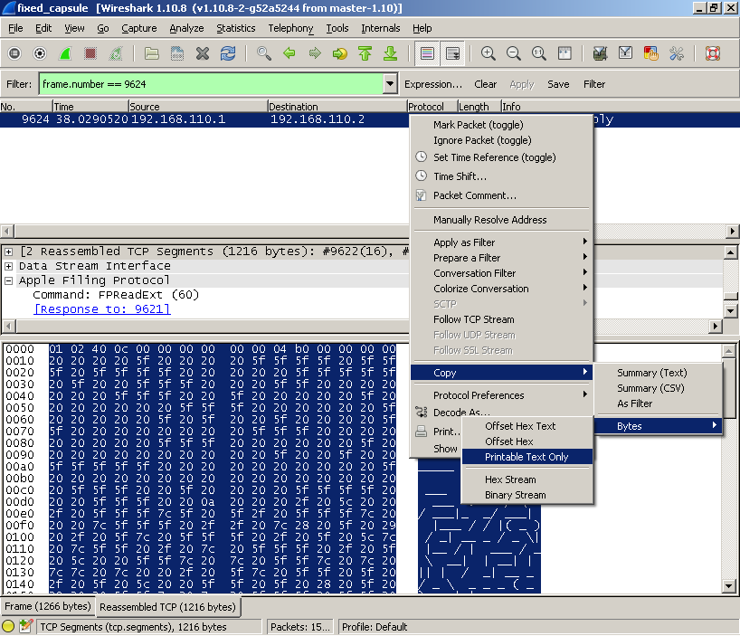

# ASIS Cyber Security Contest Finals 2014: Capsule

**Category:** Forensics
**Points:** 125
**Description:**

> Find the flag in this [file](capsule_239acad5fcfe4722e624da66c9c02542).

## Write-up

Let’s see what [the provided file](capsule_239acad5fcfe4722e624da66c9c02542) could be:

```bash
$ file capsule_239acad5fcfe4722e624da66c9c02542
capsule_239acad5fcfe4722e624da66c9c02542: xz compressed data
```

So, we extract the file using the built-in `xz` or `unxz` commands:

* `xz -dc < capsule_239acad5fcfe4722e624da66c9c02542 > capsule`
* `unxz < capsule_239acad5fcfe4722e624da66c9c02542 > capsule`

Alternatively, extract the provided file using [p7zip](http://p7zip.sourceforge.net/):

```bash
7z x capsule_239acad5fcfe4722e624da66c9c02542
```

Let’s find out what the extracted file is:

```bash
$ file capsule
capsule: data
```

Running `strings capsule` reveals that the file contains the text “Counters provided by dumpcap”. Could this be a broken packet capture file? Let’s try running `pcapfix` on it:

```bash
$ pcapfix capsule
pcapfix 1.1.0 (c) 2012-2014 Robert Krause

[*] Reading from file: capsule
[*] Writing to file: fixed_capsule
[*] File size: 2875396 bytes.
[+] This is a PCAPNG file.
[-] Minor version number: 256 ==> CORRECTED.
[-] Unknown block type!: 0x01000001 ==> SKIPPING.
[-] Block size mismatch (0x00000001 != 0x00000058) ==> CORRECTED.
[-] Found 76 bytes of unknown data ==> SKIPPING.
[-] Missing IDB for Interface #0 ==> CREATING (#0).
[*] Progress:  20.01 %
[*] Progress:  40.01 %
[*] Progress:  60.00 %
[*] Progress:  80.01 %
[+] SUCCESS: 5 Corruption(s) fixed!
```

Now we can open `fixed_capsule` in Wireshark. _Statistics_ → _Protocol Hierarchy_ reveals heavy usage of [AFP](https://nl.wikipedia.org/wiki/Apple_Filing_Protocol). After looking through the traffic for a while, we note that one particular frame contains a response that consists of ASCII art (`frame.number == 9624`).



Right-click and select _Copy_ → _Bytes_ → _Printable Text Only_ to get the response:

```
@    _    ____ ___ ____     _____ _  ___   __       ___  _     _       ___      _     _ _  _    __        ___         ___      _           _  _  _____          _                 ___  _    ____   ___
   / \  / ___|_ _/ ___|   |___ // |( _ ) / _| ___ / _ \| |__ / | ___ / _ \  __| | __| | || |  / _| __ _ / _ \  __ _ ( _ )  __| | ___ __ _| || ||___ /  ___  __| | __ _  ___ ___ ( _ )| |__|___ \ / _ \
  / _ \ \___ \| |\___ \     |_ \| |/ _ \| |_ / _ \ | | | '_ \| |/ __| | | |/ _` |/ _` | || |_| |_ / _` | | | |/ _` |/ _ \ / _` |/ __/ _` | || |_ |_ \ / _ \/ _` |/ _` |/ __/ _ \/ _ \| '_ \ __) | | | |
 / ___ \ ___) | | ___) |   ___) | | (_) |  _|  __/ |_| | |_) | | (__| |_| | (_| | (_| |__   _|  _| (_| | |_| | (_| | (_) | (_| | (_| (_| |__   _|__) |  __/ (_| | (_| | (_|  __/ (_) | |_) / __/| |_| |
/_/   \_\____/___|____/___|____/|_|\___/|_|  \___|\___/|_.__/|_|\___|\___/ \__,_|\__,_|  |_| |_|  \__,_|\___/ \__,_|\___/ \__,_|\___\__,_|  |_||____/ \___|\__,_|\__,_|\___\___|\___/|_.__/_____|\___/
                     |_____|
```

This shows the flag `ASIS_318fe0b1c0dd4fa0a8dca43edace8b20` in ASCII art.

----

**Note:** It’s also possible to find the solution by just running `strings` on the damaged packet capture file:

```bash
$ strings -n 100 fixed_capsule
    _    ____ ___ ____     _____ _  ___   __       ___  _     _       ___      _     _ _  _    __        ___         ___      _           _  _  _____          _                 ___  _    ____   ___
   / \  / ___|_ _/ ___|   |___ // |( _ ) / _| ___ / _ \| |__ / | ___ / _ \  __| | __| | || |  / _| __ _ / _ \  __ _ ( _ )  __| | ___ __ _| || ||___ /  ___  __| | __ _  ___ ___ ( _ )| |__|___ \ / _ \
  / _ \ \___ \| |\___ \     |_ \| |/ _ \| |_ / _ \ | | | '_ \| |/ __| | | |/ _` |/ _` | || |_| |_ / _` | | | |/ _` |/ _ \ / _` |/ __/ _` | || |_ |_ \ / _ \/ _` |/ _` |/ __/ _ \/ _ \| '_ \ __) | | | |
 / ___ \ ___) | | ___) |   ___) | | (_) |  _|  __/ |_| | |_) | | (__| |_| | (_| | (_| |__   _|  _| (_| | |_| | (_| | (_) | (_| | (_| (_| |__   _|__) |  __/ (_| | (_| | (_|  __/ (_) | |_) / __/| |_| |
/_/   \_\____/___|____/___|____/|_|\___/|_|  \___|\___/|_.__/|_|\___|\___/ \__,_|\__,_|  |_| |_|  \__,_|\___/ \__,_|\___/ \__,_|\___\__,_|  |_||____/ \___|\__,_|\__,_|\___\___|\___/|_.__/_____|\___/
                     |_____|
…
```

## Other write-ups and resources

* <http://shankaraman.wordpress.com/2014/10/13/asis-ctf-2014-finals-capsule-writeup/>
* <http://www.mrt-prodz.com/blog/view/2014/10/asis-ctf-finals-2014---capsule-125pts-writeup>
