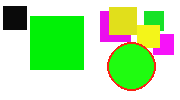

# ASIS Cyber Security Contest Finals 2014: Match the pair

**Category:** Web, PPC
**Points:** 200
**Description:**

> Go here:
>
> <http://asis-ctf.ir:12443/>

## Write-up

When we visit the given URL, we find a page where we need to play the game ‘Memory’. It displays images with a circle in them and we need to match the pairs that have the same circle color, like the two examples below.

After beating 40 levels we can find the flag at `http://asis-ctf.ir:12443/flag`.

There are 16 images (so 8 pairs) numbered 0 to 15 which can be found on `http://asis-ctf.ir:12443/pic/<pic number>`.

Checking the page’s JavaScript we find that when a user selects a pair the page sends a `GET` request to `http://asis-ctf.ir:12443/send?first=<pic number1>&second=<pic number2>`.

The server then responds with:

* `OK` if the pair is correct
* `e` if the pair is not correct
* `Done` if all pairs have been found, and you can go to the next level

We then wrote [a script](match-the-pair.py) that downloaded all 16 images and uses [OpenCV](http://opencv.org/) to detect the circle color so we could find the pairs.

Running the script gave us the flag: `ASIS_28ca740e382225131fc0501d38cf5d30`.

## Other write-ups and resources

* <http://blog.squareroots.de/en/2014/10/asis-finals-2014-match-the-pair-webppc-200/>
* <https://github.com/psmitty7373/ctf-writeups/tree/master/ASIS-2014/match_the_pair#readme>
* <http://tasteless.eu/2014/10/asis-ctf-finals-2014-match-the-pairs/>
