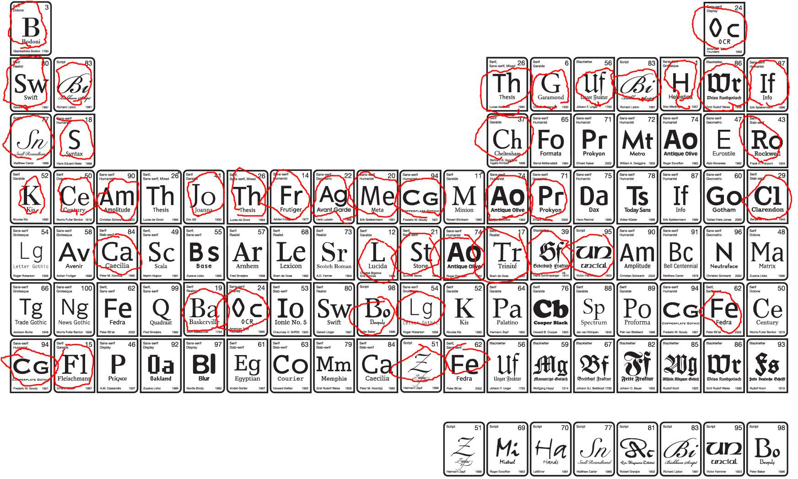

# ASIS Cyber Security Contest Finals 2014: PTOT

**Category:** Stego, Crypto
**Points:** 150
**Description:**

> Find flag in the [image](PTOT_1d23c8694e5cf6727b9ed21285a0d61f)!
>
> **Hint:** You can see that:
>
> `1 --> 3`
>
> and so on…

## Write-up

Let’s see what [the provided file](PTOT_1d23c8694e5cf6727b9ed21285a0d61f) could be:

```bash
$ file PTOT_1d23c8694e5cf6727b9ed21285a0d61f
PTOT_1d23c8694e5cf6727b9ed21285a0d61f: xz compressed data
```

So, we extract the file using the built-in `xz` or `unxz` commands:

* `xz -dc < PTOT_1d23c8694e5cf6727b9ed21285a0d61f > ptot`
* `unxz < PTOT_1d23c8694e5cf6727b9ed21285a0d61f > ptot`

Alternatively, extract the provided file using [p7zip](http://p7zip.sourceforge.net/):

```bash
7z x PTOT_1d23c8694e5cf6727b9ed21285a0d61f
```

Let’s find out what the extracted file is:

```bash
$ file ptot
ptot: JPEG image data, JFIF standard 1.01
```

The image contains the ‘Periodic Table of Typefaces’ of which you can find [a PDF version online](http://www.voiceonapage.com/ProjectsTypography/Typeface%20Poster/PTOT.pdf).

If we compare the original image with the image of the challenge we can see many differences. The differences are highlighted in the following [self-made image](PTOT_diff.jpg):



Studying this image while keeping the hint in mind we notice that the first element became the third, hence `1 --> 3`. Let’s try to do this mapping for all the changes. We propably only need to focus on the numbers as the hint suggested. Below you can see a map with only the numbers so we can focus more on the important things.

```
numbers from the original image:

1                                                               2
4   5                                       8   9   14  18  20  22  3
16  27                                      32  65  71  72  74  47  13
31  40  21  26  30  7   17  19  6   10  11  12  15  75  78  87  60  44
54  58  38  49  55  57  68  73  23  28  34  35  36  37  90  91  96  48
66  100 62  99  29  43  53  80  41  42  52  64  76  88  89  94  25  50
24  45  46  92  97  61  63  79  84  33  39  56  59  67  82  85  86  92


numbers from our challenge image (only the ones on an incorrect position):

3                                                               24
80  83                                      26  6   56  83  1   86  87
77  18                                      37                      43
52  50  90      41  26  14  22  20  94      74  71                  29
        84                      12  21  74  17  39  95
                19  24          98  54                          62
94  15                              51  62
```

Note that 43 elements are in the wrong place BUT if you include the two elements that had an `\*` next to their number, that totals up to 45 elements. Even more curious is they are on the positions coresponding to the first 45 elements. So the elements going from `1` to `45` of the original image are replaced by a different element (with a different number) in our given image.

Then we got the idea of making a large string. At position `1` is number `3`, at position `2` we would have `24`, number `87` is at position `3` and so on. This gives us the following string:

```
032487808320262606941174435671771483220190861294622618211941523751741739958462509854242915
```

Maybe this number means something? Let’s take this integer and format it in hexadecimal notation.

```bash
$ python -c 'print "%x" % 32487808320262606941174435671771483220190861294622618211941523751741739958462509854242915'
415349535f6339613163643231646235643338393233353632666363616262636138303863
```

Then let’s translate that hex to ASCII text, in case it gives us another hint:

```bash
$ xxd -r -p <<< '415349535f6339613163643231646235643338393233353632666363616262636138303863'
ASIS_c9a1cd21db5d38923562fccabbca808c
```

The flag is `ASIS\_c9a1cd21db5d38923562fccabbca808c`.

## Other write-ups and resources

* <http://blogs.univ-poitiers.fr/e-laize/2014/10/13/asis-2014-ptot/>
