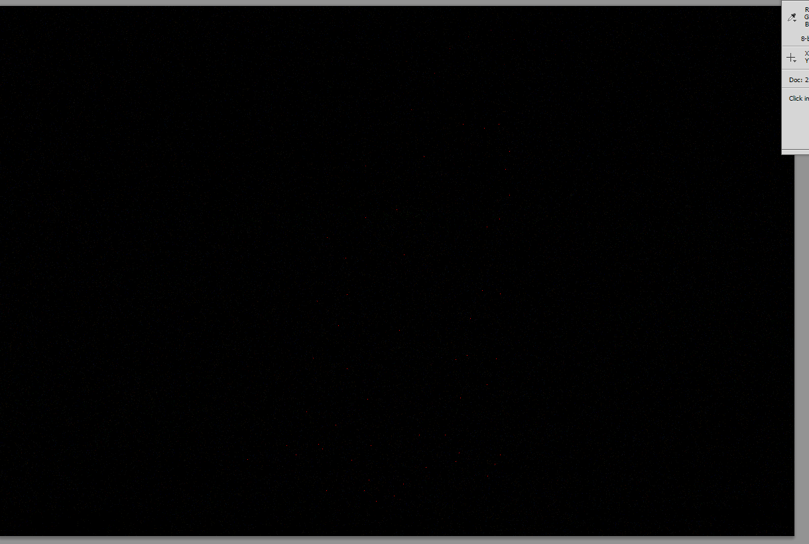

# ASIS Cyber Security Contest Finals 2014: What you see?

**Category:** Stego
**Points:** 175
**Description:**

> Download the [file](milad_eb1ac478beffbbd33c564fbe6396042f).

## Write-up

Let’s see what [the provided file](milad_eb1ac478beffbbd33c564fbe6396042f) could be:

```bash
$ file milad_eb1ac478beffbbd33c564fbe6396042f
milad_eb1ac478beffbbd33c564fbe6396042f: xz compressed data
```

So, we extract the file using the built-in `xz` or `unxz` commands:

* `xz -dc < milad_eb1ac478beffbbd33c564fbe6396042f > milad`
* `unxz < milad_eb1ac478beffbbd33c564fbe6396042f > milad`

Alternatively, extract the provided file using [p7zip](http://p7zip.sourceforge.net/):

```bash
7z x milad_eb1ac478beffbbd33c564fbe6396042f
```

Let’s find out what the extracted file is:

```bash
$ file milad
milad: PNG image data, 1200 x 800, 8-bit/color RGB, non-interlaced
```

The PNG file did not contain any apparent stego elements. Googling for the photography studio which made the image (Behrouz Jafarnezhad Photography) quickly lead us to [the page with the original image](http://behrouzjafarnezhadphotography.com/2012/02/17/tehran-so-close-so-far/). Unfortunately, the image displayed there had different dimensions (1024×682 vs. 1200×800). If you could somehow find the original image, we could diff it with the provided challenge image. The URL of the image we found was:

```
http://behrouzjafarnezhadphotography.com/wp-content/uploads/2012/02/IMG_3422-1024x682.jpg
```

We tried replacing the dimensions in the URL to the correct ones, but that resulted in a 404 page:

```
http://behrouzjafarnezhadphotography.com/wp-content/uploads/2012/02/IMG_3422-1200x800.jpg
```

After the CTF we learned that when the dimensions are omitted from the URL entirely, the original-size image is loaded.

```
http://behrouzjafarnezhadphotography.com/wp-content/uploads/2012/02/IMG_3422.jpg
```

Diffing this with the challenge image reveals some very subtle red dots that form a penguin when connected.



However, since we didn’t manage to discover all that during the CTF, we took a different approach…

Before submitting a potential flag was submitted to the ASIS servers, it was first checked for validity on the client side. More concretely: the flag was `SHA256()`’d twice, and compared with a certain value. Since we knew the format of the flag (`ASIS_MD5()`), we decided to see if they included frequently used words/passwords. We quickly fired up a Python script, which would go through [the list of the famously leaked RockYou passwords](https://wiki.skullsecurity.org/index.php?title=Passwords), compute the hashes, and compare them with the SHA256 value provided by ASIS. Seconds later, we found the correct answer for the “What you see?” challenge was `ASIS_MD5(penguin)`. Without having to jump through too many hoops to find and diff the original image, we happily submitted the flag: `ASIS_24f7ca5f6ff1a5afb9032aa5e533ad95`.

## Other write-ups and resources

* none yet
