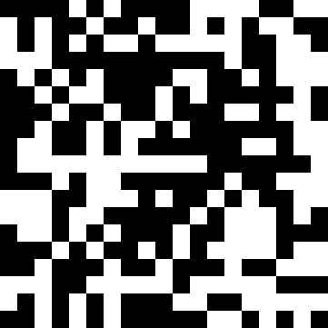
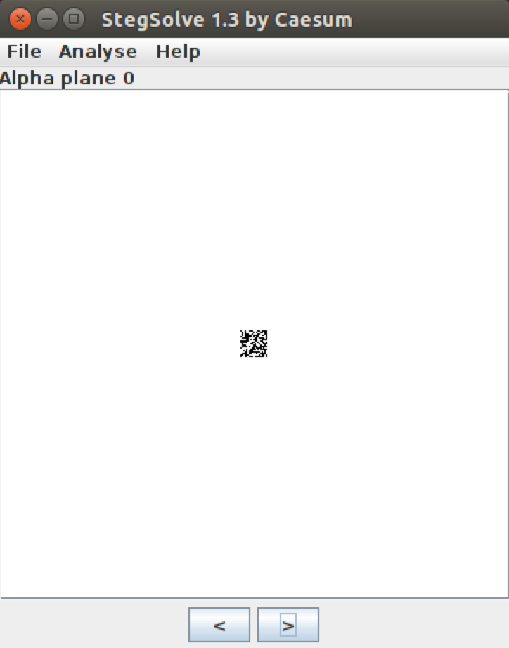

# ASIS Cyber Security Contest Quals 2014: Blocks

**Category:** Crypto, Stego
**Points:** 100
**Description:**

> [stego\_100\_e62586adf1bcc7de668fa562955c0aa5](stego_100_e62586adf1bcc7de668fa562955c0aa5)

## Write-up

After extracting the xz-compressed POSIX tar archive, we are given a file, `stego_100_e62586adf1bcc7de668fa562955c0aa5f`, which is a `361x361` (Factorization of `361`: `19x19`) pixel wide and high picture:

```
$ file stego_100_e62586adf1bcc7de668fa562955c0aa5f
stego_100_e62586adf1bcc7de668fa562955c0aa5f: PNG image data, 361 x 361, 8-bit/color RGBA, non-interlaced
```

We open the picture and see this:



There are `19x19` black or white blocks, which are each again `19x19` pixels wide and high.
We suggest that a black/white block represents a `0`/`1`.

Now we stegoanalyse this picture to notice any peculiarities using [Stegsolve](http://www.wechall.net/download/12/Stegsolve_jar) and find a hidden `19x19` block in the alpha channel (alpha plane 0):



Xoring the binary representation of the original image with this alpha block using [this script](picxoralpha.py) ([source](http://hexpresso.wordpress.com/2014/05/10/asis-ctf-quals-2014-stego-100-blocks-write-up/)), we are getting the flag:

> flag  = ASIS_08213db585ffe1c93c8f04622c319594

## Other write-ups and resources

* <http://hexpresso.wordpress.com/2014/05/10/asis-ctf-quals-2014-stego-100-blocks-write-up/>
