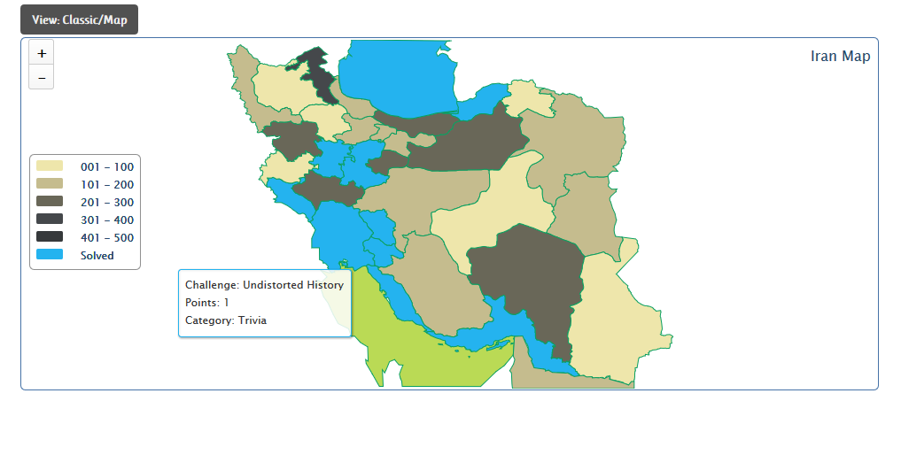

# ASIS Cyber Security Contest Quals 2014: Undistorted History

**Category:** Trivia
**Points:** 1
**Description:**

> What is the name of this place?
> No need to calculate MD5 or appending `ASIS_`.

## Write-up

Checking the location on the map view  revealed that the Challenge was located at the Persian Gulf.

The flag is `Persian Gulf`.

## Other write-ups and resources

* none yet
