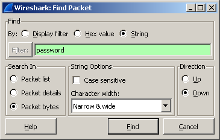
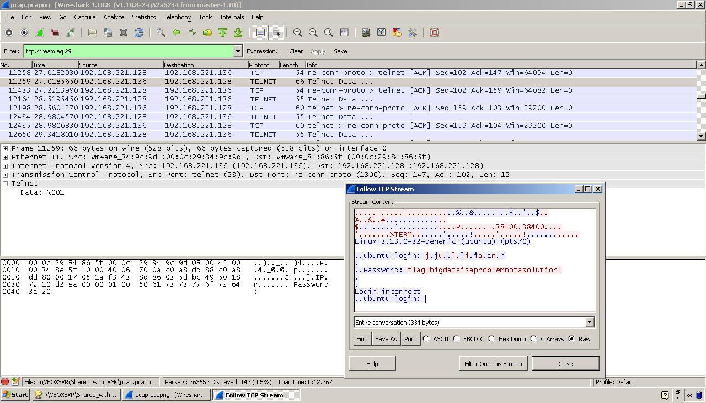

# CSAW CTF 2014: Big Data

**Category:** Networking
**Points:** 100
**Description:**

> Something, something, data, something, something, big
>
> Written by HockeyInJune
>
> [pcap.pcapng](pcap.pcapng)

## Write-up

Open [the provided `pcap.pcapng` file](pcap.pcapng) in Wireshark. Go to _Edit_ → _Find Packet_ → _String_ → _Search in packet bytes_, and enter `password`.



This reveals an exchange over the `telnet` protocol where a server asks for a password. The next packets each contain a single character of the password, sent from the client to the server. To quickly view them all, right-click on the first packet and click _Follow TCP Stream_.



This reveals the following:

```
Linux 3.13.0-32-generic (ubuntu) (pts/0)

..ubuntu login: j.ju.ul.li.ia.an.n
.
..Password: flag{bigdataisaproblemnotasolution}
.
.
Login incorrect
..ubuntu login:
```

The flag is `bigdataisaproblemnotasolution`.

## Other write-ups

* <http://evandrix.github.io/ctf/2014-csaw-networking-100-bigdata.html>
* <http://shankaraman.wordpress.com/2014/09/22/csaw-ctf-2014-networking-100-bigdata-writeup/>
