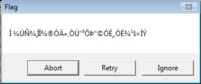
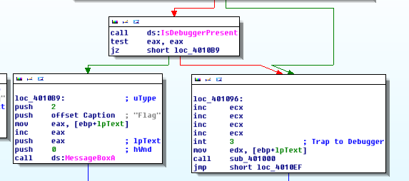
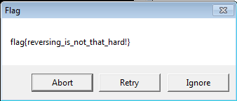

# CSAW CTF 2014: csaw2013reversing2.exe

**Category:** Reverse Engineering
**Points:** 200
**Description:**

> We got a little lazy so we just tweaked an old one a bit
>
> Written by HockeyInJune
>
> [csaw2013reversing2.exe](csaw2013reversing2.exe)

## Write-up

The description to the write-up hints that the challenge is just a modified version of the CSAW reversing challenge of last year.
Googling for some write-ups I found out that the previous version contained an encrypted flag which got decrypted inside a debugger trap.

Running the file gives us a dialog box with ‘Flag’ as caption and then some random bytes. So the challenge probably still has an encrypted flag which needs to be decrypted.

Opening the file in IDA we indeed see two flows. One creates a dialog box (on the left), the other creates a debugger trap and decrypts the flag (on the right).

We want to patch the file so it runs the decryption and then the dialog box.

This can be done as follows:

1. Replace `jz short loc_4010B9` with `jmp short loc_401096`.
2. Replace `jmp short loc_4010EF` with `jmp short loc_4010B9`.
3. Replace the `inc ECX` and `int 3` instructions in the debugger trap with `NOP`.

After doing this we get the patched file [`csaw2013reversing2-patched.exe`](csaw2013reversing2-patched.exe).

Running this patched executable gives us a dialog box with the flag:

## Other write-ups and resources

* <http://www.mrt-prodz.com/blog/view/2014/09/csaw-ctf-quals-2014---csaw2013reversing2exe-200pts-writeup>
* <https://ucs.fbi.h-da.de/writeup-csaw-csaw2013reversing2-exe/>
* <http://naper.eu/blog/index.php?controller=post&action=view&id_post=3/>
