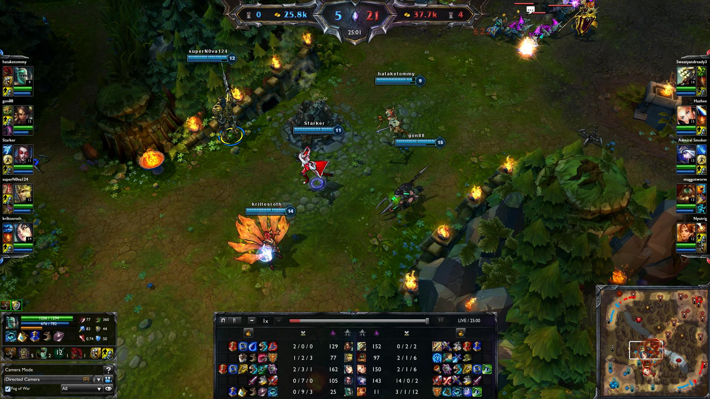
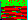

# D-CTF 2014: Misc 300 – LooL

**Category:** Misc
**Points:** 300
**Description:**

> 

## Write-up

For this challenge, only an image is provided. However, inspecting the challenge page’s source code, we find this HTML comment:

```html
<!--iVBORw0KGgoAAAANSUhEUgAAABwAAAAUCAIAAAARPMquAAAACXBIWXMAAA7EAAAOxAGVKw4bAAAAB3RJTUUH3goNFiAI385k0QAAAPVJREFUOMuNVEESxCAIC47/Nr6cPahbpUDtCRWTEDMVKNxPAQhEoQJRAE9h6tdSCzpdUPkXaguDOI5UnmUZTT7uEuju7zLNZomaIoh327uhRAKTCRK9Iah7LScwzdWcMbjcgyMSBBoP9JoAmcugQsVIbl52DqUtBm0cuV1yFocrqE4VMa3/9ETfODylnNmVdmVFPhmn0phz9un5zIuZgOaeZobKjikDd5jWo/GHEJ4qEKgYPoFH2nylC+qju104Oz010euxD921WxSUfayaMAu3q4vZxIPLjW7G7/H7Lmc/4mHmqB6/72y7iy23H7wSt7nPxxLVH88jbs4UmdXpAAABlmlUWHRYTUw6Y29tLmFkb2JlLnhtcAAAAAAAPD94cGFja2V0IGJlZ2luPSfvu78nIGlkPSdXNU0wTXBDZWhpSHpyZVN6TlRjemtjOWQnPz4KPHg6eG1wbWV0YSB4bWxuczp4PSdhZG9iZTpuczptZXRhLycgeDp4bXB0az0nSW1hZ2U6OkV4aWZUb29sIDkuNDYnPgo8cmRmOlJERiB4bWxuczpyZGY9J2h0dHA6Ly93d3cudzMub3JnLzE5OTkvMDIvMjItcmRmLXN5bnRheC1ucyMnPgoKIDxyZGY6RGVzY3JpcHRpb24gcmRmOmFib3V0PScnCiAgeG1sbnM6ZGM9J2h0dHA6Ly9wdXJsLm9yZy9kYy9lbGVtZW50cy8xLjEvJz4KICA8ZGM6ZGN0Zj42ZmI1MzI5NWI1MzVlYmRmZmExYWM4ODQzZmM2YWNkZDwvZGM6ZGN0Zj4KIDwvcmRmOkRlc2NyaXB0aW9uPgo8L3JkZjpSREY+CjwveDp4bXBtZXRhPgo8P3hwYWNrZXQgZW5kPSdyJz8+KPPlkwAAAABJRU5ErkJggg==-->
```

That looks like base64. Let’s see what it decodes to:

```bash
$ base64 --decode <<< 'iVBORw0KGgoAAAANSUhEUgAAABwAAAAUCAIAAAARPMquAAAACXBIWXMAAA7EAAAOxAGVKw4bAAAAB3RJTUUH3goNFiAI385k0QAAAPVJREFUOMuNVEESxCAIC47/Nr6cPahbpUDtCRWTEDMVKNxPAQhEoQJRAE9h6tdSCzpdUPkXaguDOI5UnmUZTT7uEuju7zLNZomaIoh327uhRAKTCRK9Iah7LScwzdWcMbjcgyMSBBoP9JoAmcugQsVIbl52DqUtBm0cuV1yFocrqE4VMa3/9ETfODylnNmVdmVFPhmn0phz9un5zIuZgOaeZobKjikDd5jWo/GHEJ4qEKgYPoFH2nylC+qju104Oz010euxD921WxSUfayaMAu3q4vZxIPLjW7G7/H7Lmc/4mHmqB6/72y7iy23H7wSt7nPxxLVH88jbs4UmdXpAAABlmlUWHRYTUw6Y29tLmFkb2JlLnhtcAAAAAAAPD94cGFja2V0IGJlZ2luPSfvu78nIGlkPSdXNU0wTXBDZWhpSHpyZVN6TlRjemtjOWQnPz4KPHg6eG1wbWV0YSB4bWxuczp4PSdhZG9iZTpuczptZXRhLycgeDp4bXB0az0nSW1hZ2U6OkV4aWZUb29sIDkuNDYnPgo8cmRmOlJERiB4bWxuczpyZGY9J2h0dHA6Ly93d3cudzMub3JnLzE5OTkvMDIvMjItcmRmLXN5bnRheC1ucyMnPgoKIDxyZGY6RGVzY3JpcHRpb24gcmRmOmFib3V0PScnCiAgeG1sbnM6ZGM9J2h0dHA6Ly9wdXJsLm9yZy9kYy9lbGVtZW50cy8xLjEvJz4KICA8ZGM6ZGN0Zj42ZmI1MzI5NWI1MzVlYmRmZmExYWM4ODQzZmM2YWNkZDwvZGM6ZGN0Zj4KIDwvcmRmOkRlc2NyaXB0aW9uPgo8L3JkZjpSREY+CjwveDp4bXBtZXRhPgo8P3hwYWNrZXQgZW5kPSdyJz8+KPPlkwAAAABJRU5ErkJggg==' > comment

$ file comment
comment: PNG image data, 28 x 20, 8-bit/color RGB, non-interlaced

$ mv comment comment.png
```

The resulting `comment.png` file looks like this:



Let’s check its EXIF data:

```bash
$ exiftool comment.png
ExifTool Version Number         : 9.72
File Name                       : comment.png
Directory                       : .
File Size                       : 760 bytes
File Modification Date/Time     : 2014:10:19 17:00:51+02:00
File Access Date/Time           : 2014:10:19 16:58:04+02:00
File Inode Change Date/Time     : 2014:10:19 17:00:51+02:00
File Permissions                : rw-r--r--
File Type                       : PNG
MIME Type                       : image/png
Image Width                     : 28
Image Height                    : 20
Bit Depth                       : 8
Color Type                      : RGB
Compression                     : Deflate/Inflate
Filter                          : Adaptive
Interlace                       : Noninterlaced
Pixels Per Unit X               : 3780
Pixels Per Unit Y               : 3780
Pixel Units                     : meters
Modify Date                     : 2014:10:13 22:32:08
XMP Toolkit                     : Image::ExifTool 9.46
Dctf                            : 6fb53295b535ebdffa1ac8843fc6acdd
Image Size                      : 28x20
```

That `Dctf` entry with value `6fb53295b535ebdffa1ac8843fc6acdd` looks interesting, but it isn’t the flag. Googling it reveals that it is the MD5 hash of the string `brainloller`. [_Brainloller_](http://esolangs.org/wiki/Brainloller) is a visual dialect of [the _brainfuck_ programming language](https://en.wikipedia.org/wiki/Brainfuck).

What if [`comment.png`](comment.png) is a Brainloller program? Using [an open-source Brainloller implementation](https://github.com/Fedcomp/Brainloller-class) we find out the image translates to the following brainfuck program:

```brainfuck
++++++++[>+>++>+++>++++>+++++>++++++>+++++++>++++++++>+++++++++>++++++++++>+++++++++++>++++++++++++>+++++++++++++>++++++++++++++>+++++++++++++++>++++++++++++++++<<<<<<<<<<<<<<<<-]>>>>>>>>>>>>>>>+.-<<<<<<<<<<<<<<<>>>>>>>>>>>>>>-.+<<<<<<<<<<<<<<>>>>>>>>>>>>>>>---.+++<<<<<<<<<<<<<<<>>>>>>>>>>>>>----.++++<<<<<<<<<<<<<>>>>>>>>>>>>>+.-<<<<<<<<<<<<<>>>>>>>>>>>>>----.++++<<<<<<<<<<<<<>>>>>>>>>>>>>>>-.+<<<<<<<<<<<<<<<>>>>>>>>>>>>>---.+++<<<<<<<<<<<<<>>>>>>>>>>>>>>----.++++<<<<<<<<<<<<<<>>>>>>>>>>>>>>----.++++<<<<<<<<<<<<<<.
```

This program prints the flag `youdidwell`.

## Other write-ups and resources

* none yet
