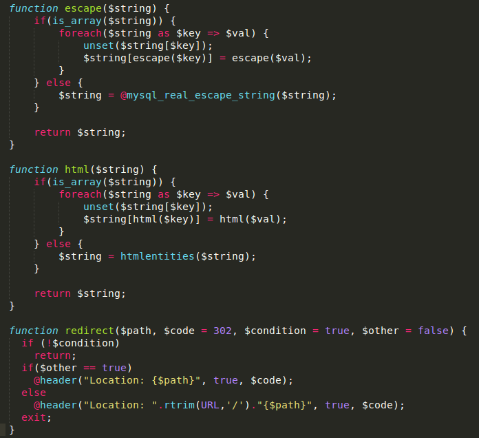

# D-CTF 2014: Web 100 – Find me

**Category:** Web
**Points:** 100
**Description:**

> Find the bug.
>
> 
>
> **Hint:** it's a "word".

## Write-up

The answer was `ENT_QUOTES`. If `htmlspecialchars` is used with its default settings (as in the provided code example), single quotes (`'`) aren’t HTML-encoded, leading to potential XSS vulnerabilities in HTML attributes. Setting the `ENT_QUOTES` flag would have prevented that.

## Other write-ups and resources

* none yet
