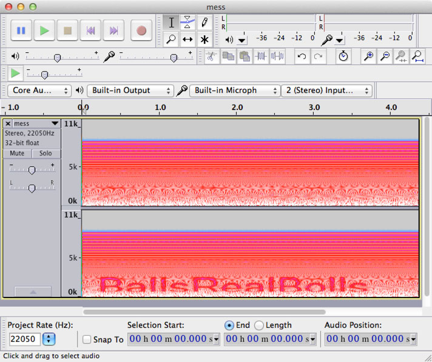

# DEFKTHON CTF: Miscellaneous 300

**Description:**

> [Check This](73168.zip)

## Write-up

The provided [`73168.zip`](73168.zip) file is password-protected. Cracking the password using `fcrackzip` reveals that an all-numeric password was used, and that the zip file contains another password-protected zip file, which in turn contains another password-protected zip file, etc.

Let’s write a script that recursively cracks and extracts the zip files:

```bash
#!/usr/bin/env bash

while [ -e *.zip ]; do
  files=*.zip;
  for file in $files; do
    echo -n "Cracking ${file}… ";
    output="$(fcrackzip -u -l 1-6 -c '1' *.zip | tr -d '\n')";
    password="${output/PASSWORD FOUND\!\!\!\!: pw == /}";
    if [ -z "${password}" ]; then
      echo "Failed to find password";
      break 2;
    fi;
    echo "Found password: \`${password}\`";
    unzip -q -P "${password}" "$file";
    rm "${file}";
  done;
done;
```

Leave it running for a while, and you’ll end up with `12475.zip`, a zip file with a slightly more complex password. Let’s crack it:

```bash
$ fcrackzip -u -l 1-6 -c 'a1' 12475.zip
PASSWORD FOUND!!!!: pw == b0yzz
```

The password is `b0yzz`. Let’s unzip:

```bash
$ unzip -q -P b0yzz 12475.zip
```

We end up a file named [`mess.wav`](mess.wav). Open it in a sound editor like Audacity, and view the sound waves as a spectrogram.



It reveals the text `BallsRealBolls`, which is the flag.

## Alternative approach

An alternative way to come up with the passwords for all the intermediate zip files, is by using `unzip -l` to list the compressed file’s file name (which was always the same as the password for the parent zip for this challenge):

```bash
#!/usr/bin/env bash

f="$1";

while test -e "$f"; do
  mv "$f" _a.zip;
  p=$(unzip -l _a.zip | grep -v Archive | grep zip | awk '{print $NF}' | sed 's:\.zip::'| head -1);
  echo "File = '_a.zip', password = '$p'";
  unzip -P "$p" _a.zip;
  f="$p.zip";
  ls -l "$f";
done;
```

## Other write-ups and resources

* <http://tasteless.eu/2014/03/defkthon-ctf-2014-rev200-misc200-recon200-misc300/>
* <http://juicy-media.ru/dv_team/writeups/index.php?cnt=DEFKTHON&cat=Misc&prc=300.
* <https://shankaraman.wordpress.com/2014/03/05/defkthon-ctf-misc-300-writeup/>
