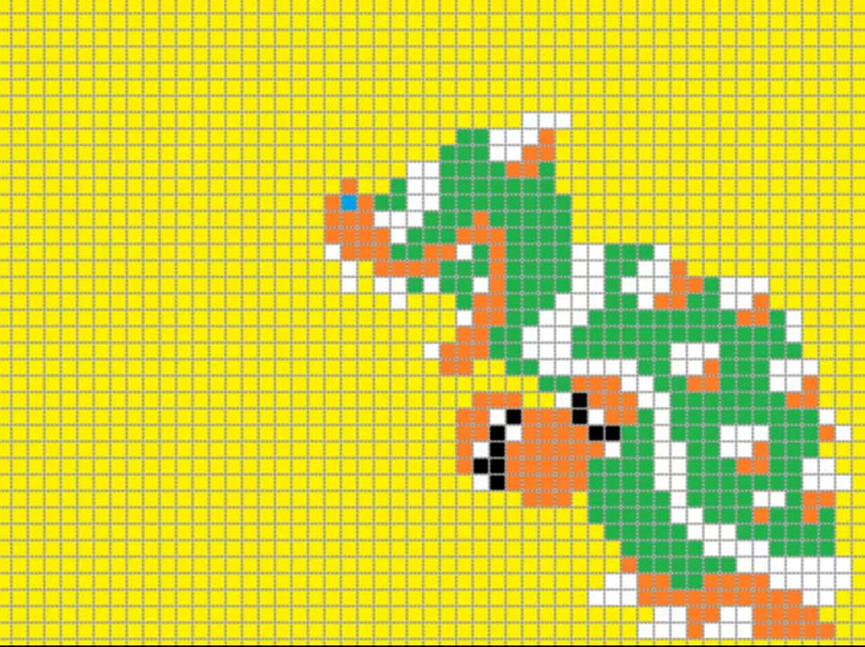
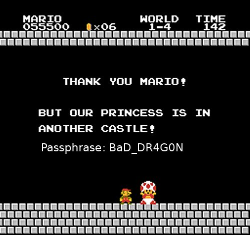
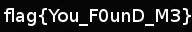

# ECTF 2014: Pixel Princess

**Category:** Forensics
**Points:** 200
**Description:**

> Find the princess. Get the flag.
>
> [`bowser.tar.gz`](bowser.tar.gz)

## Write-up

First we ran the `file` command on the given zip which showed that the zip is a gzip compressed data.

```
file bowser.tar.gz
bowser.tar.gz: gzip compressed data, from Unix, last modified: Thu Oct 16 04:54:39 2014
```

Running
```
tar -xzvf bowser.tar.gz
```

provides us with an image `bowser.jpg`



Running `strings` on the `jpg` file shows there is a file zipped in image

```
strings bowser.jpg
.
.
.
MarioCastle.jpgUT
>Tux
```

This gives a clue that image file `MarioCastle.jpg` compressed in `bowser.jpg` file might contain flag.

Running `unzip` command on `bowser.jpg` inflates the `MarioCastle.jpg` file.


This first indicates that `MarioCastle.jpg` is also a zip file with password, but that leads to nothing. So another option is to use `steghide`

Running
```
steghide extract -sf MarioCastle.jpg
```

and entering password for `MarioCaste.jpg` returns nothing, so we tried `steghide` on original image `bowser.jpg` which works :) and gives a `tar.gz` file, which we extarct to get a jpg file with flag as `You_F0unD_m3`.



## Other write-ups and resources

* <https://shankaraman.wordpress.com/2014/10/19/ectf-2014-forensics-200-pixel-princess-writeup/>
* <http://apsdehal.in/blog/pixel-princess/>