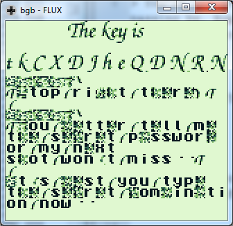

# Hack.lu CTF 2014: At Gunpoint

**Category:** Reversing
**Points:** 200
**Author:** freddy
**Description:**

> You’re the sheriff of a small town, investigating news about a gangster squad passing by. Rumor has it they’re easy to outsmart, so you have just followed one to their encampment by the river. You know you can easily take them out one by one, if you would just know their secret handshake…
>
> Download: [gunpoint_2daf5fe3fb236b398ff9e5705a058a7f.dat](gunpoint_2daf5fe3fb236b398ff9e5705a058a7f.dat)

## Write-up

```bash
$ file gunpoint_2daf5fe3fb236b398ff9e5705a058a7f.dat
gunpoint_2daf5fe3fb236b398ff9e5705a058a7f.dat: Gameboy ROM: "FLUX", [ROM ONLY], ROM: 256Kbit
```

So it appears to be a Gameboy game. When running it in an emulator, an image of a cowboy is shown. After some time the screen changes and you are requested to input a correct sequence to get the key.

There are multiple ways of solving this issue. For example, you can extract the sprites from the ROM and puzzle them back together. There’s an easier solution, however. From a programming point of view, it would be logical if the game would call a specific function when the right input was given. So why not just try calling all of those functions at the beginning of the file?

Using [bgb](http://bgb.bircd.org/) you can easily manipulate the instruction pointer and jump all over the code. Simply select a line and press `F6`. By jumping to different call statements, you end up at `0ED4`, which is a call to `0200`. When jumping to `0ED5`, the key is displayed on screen:



It’s a little hard to read, but the flag is `tkCXDJheQDNRN`.

## Other write-ups and resources

* [Write-up by tasteless](http://tasteless.eu/2014/10/hack-lu-ctf-2014-at-gunpoint/)
* [Write-up by @bernardomr](http://w00tsec.blogspot.com/2014/10/hacklu-2014-ctf-write-up-at-gunpoint.html)
* <http://radare.today/solving-at-gunpoint-from-hack-lu-2014-with-radare2/>
