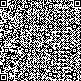

# HITCON CTF 2014: maze

**Category:** Game
**Points:** 250
**Description:**

> Capture the flag in the maze!
>
> ```bash
> telnet 210.71.253.213 8473
> ```

**Hint:**

> If you have found the flag but get wrong flag response… read it carefully, or just pm admin.

## Write-up

```bash
$ telnet 210.71.253.213 8473
Trying 210.71.253.213...
Connected to 210-71-253-213.hinet-ip.hinet.net.
Escape character is '^]'.

You have 10 minutes to capture the flag :)
Loading...
```

Once the game has finished loading, it prints:

```
.@..@....
@..@..@..
@....@@.@
@@...@@@@
@..@o....
.@@...@.@
..@.@..@.
@.....@@@
..@@.@.@@
```

The `o` character in the center marks your current location. `@` are walls, and `.` are ‘walkable’ areas. You can move around using the arrow keys.

After mapping the (huge) area completely, it turns out the maze represents [a QR code](qrcode.svg):



Decoding this results in an ASCII art version of the flag:

```
.  . , ,---.  ,-.  ,-.  .  . ,-  ,-.   ,-.  .   ,  ,.  ,---, ,--.   ,  ,-.     ,-.  ,-.   ,-.  ,    . -.
|  | |   |   /    /   \ |\ | \  /   \  |  ) |\ /| /  \    /  |      | (   `   /    /   \ /   \ |    |  /
|--| |   |   |    |   | | \| <  |   |  |-<  | V | |--|   /   |-     |  `-.    |    |   | |   | |    |  >
|  | |   |   \    \   / |  | /  \   X  |  \ |   | |  |  /    |      | .   )   \    \   / \   / |       \
'  ' '   '    `-'  `-'  '  ' `-  `-' ` '  ' '   ' '  ' '---' `--'   '  `-'     `-'  `-'   `-'  `--' o -'
```

The flag is `HITCON{QRMAZEISCOOL!}`.

## Other write-ups and resources

* [source](https://github.com/hitcon2014ctf/ctf/tree/master/maze)
