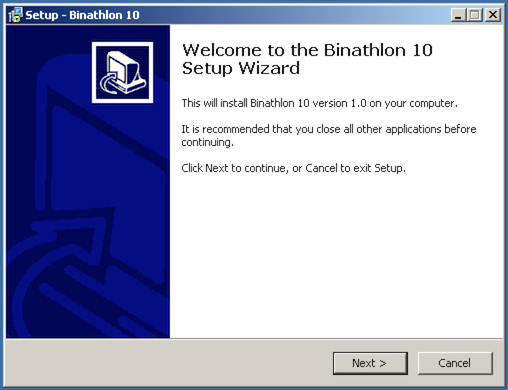
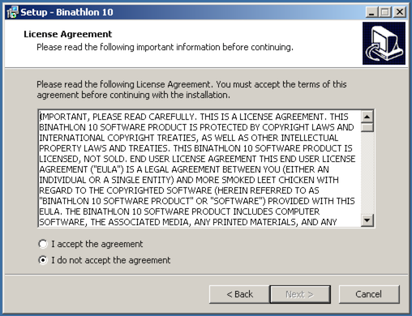
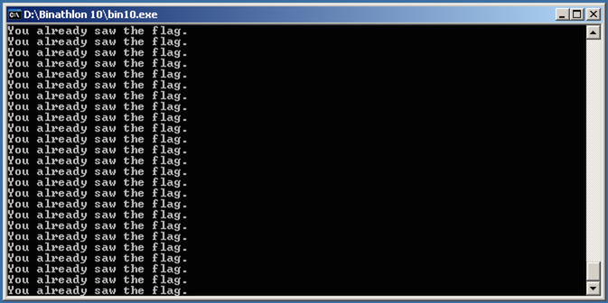
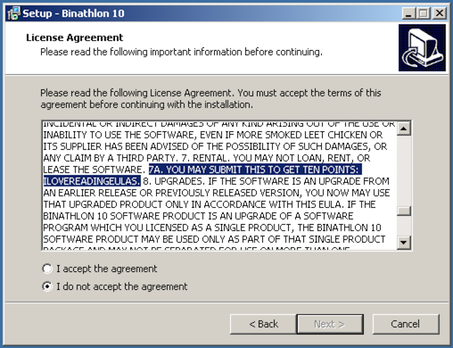

# Olympic CTF 2014: Just No One

**Category:** Binathlon (Bin)
**Points:** 10
**Author:** vos
**Description:**

> Here’s your binary: [`setup.exe`](setup.exe)

## Write-up

The provided `setup.exe` file is a standard installation wizard.

As usual with these wizards, the second screen contains a very long license agreement that must be accepted before continuing the installation.

The next screen prompts for a password. Which password? Hmm… It’s possible to [crack it](http://maroueneboubakri.blogspot.com/2014/02/olympic-ctf-sochi-2014-binathlon-10.html) and then proceed with the installation, but that doesn’t really help, because when the executable is opened, it just repeats “You already saw the flag.”:

And indeed — after running `setup.exe` again and carefully reading the license agreement this time, we notice something unusual:

The flag is `ILOVEREADINGEULAS`.

## Other write-ups and resources

* <http://maroueneboubakri.blogspot.com/2014/02/olympic-ctf-sochi-2014-binathlon-10.html>
* <https://ctftime.org/writeup/926>
* <http://cybersecurity.cci.fsu.edu/olympic-ctf-2014-writeup/>
* <http://delimitry.blogspot.ru/2014/02/olympic-ctf-2014-writeups.html>
* <http://ctfwriteups.blogspot.jp/2014/02/olympic-ctf-2014-binathlon-10-just-no.html>
* [Chinese](http://ddaa.logdown.com/posts/178446-olympic-ctf-2014-10-point-summary)
