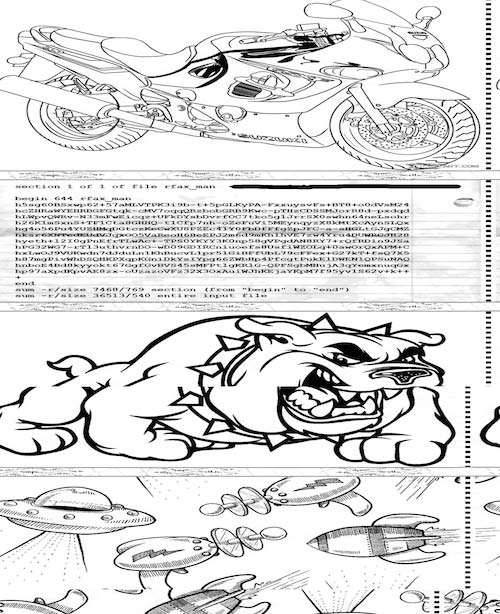

# Olympic CTF 2014: Make similar

**Category:** Freestyle (Misc.)
**Points:** 400
**Author:** psb
**Description:**

> [Listen](similar.ogg) carefully and try to figure out. Hint: 120 LPM
>
> _Flag format: `CTF{..32 hexes..}`_

## Write-up

The “120 LPM” hint refers to [weather fax](http://en.wikipedia.org/wiki/Radiofax), an analog mode for transmitting monochrome images.

There’s an OS X application called [Multimode](http://www.blackcatsystems.com/software/multimode/fax.html#HOWREC) which can be used to convert the audio back into the original fax images. It only accepts WAV files as input though, so first I converted [`similar.ogg`](similar.ogg) to `similar.wav` using Audacity. The result looks something like this:



The text is the following:

```
section 1 of 1 of file rfax_man
begin 644 rfax_man
h5sg60BSxwp62+57aMLVTPK3i9b-t+5pGLKyPA-FxxuysvFs+BT8+o0dVsM24
hcZHRaWYEHRBGFGtqk-cMV7oqqQRzbobGRB9Kwc-pTHzCDSSMJorR8d-pxdqd
hLWpvQWRv-N33mFwEicqz+UFkDYsbDvrfOC7tko5g1JrrSX0swhn64neLsohr
h26K1mSxnS+TF1Cta8GHHQ-t1Cfp7nh-oZeFuVi5MEynqyzX8kMtXcAynSLQx
hg4o56Pu4YUZHMqDGtczKeCwXU8PZEc4lY0FbDfFfgZpJFC-a-sHGLtGJgCMZ
hksr6XNTedEUdVJqxOO5VaReoH68eEPJ2m6d9mKhlhVE7zw4Yru4DUWRCJH28
hyeth+l2I0gPnEfrTLwAc+-TPS0YKYY3K0np58gVPgdAN8RY7+rQfRDin9JSa
hPG32WG7-rTl3uthvrnDO-wD09GDIRCniuoefs8UsfiWZOLq+0awOrQxAPM+C
hxLwOJ9VUKwdn7dJduLn1KhBucvL1pr5lGiBFfUbL79cFFex+G27kT+fsQ7X5
h87mgPivWhDSQHKPXqpKGniDkYsIYpg66ZWbHp4PfcgtPukElDWENlQPSuNAQ
hnboE4Bd8kyyokt67GgfGvBVS45sMFPtlgKRlG-QPFSgbMHujA3qYemxnuqGx
hp97aXpdKpvAE8zx-oUzazoVFz32X3OxAuiWJhKEjaYKpM7f95yv1S62v+k++
+
end
sum —r/size 7468/769 section (from "begin" to "end")
sum —r/size 36513/540 entire input file
```

This looks like [xxencoded](http://en.wikipedia.org/wiki/Xxencoding) text. Let’s [decode it using an online xxdecoder](http://www.webutils.pl/XXencode). This results in a file named `rfax_man`. What could it be?

```bash
$ file rfax_man
rfax_man: gzip compressed data, was "rfax_man.py", from FAT filesystem (MS-DOS, OS/2, NT), last modified: Thu Feb  6 17:52:39 2014, max speed
```

It’s gzip-compressed data! Let’s find out what it is:

```bash
$ gunzip < rfax_man > rfax_man_unzipped
```

It seems `rfax_man_unzipped` is a Python script:

```python
import socket,os,sys,hashlib

KEY  = "CTF{4BDF4498E4922B88642D4915C528DA8F}" # DO NOT SHARE THIS!
HOST = '109.233.61.11'
PORT = 8001

if len(sys.argv)<3:
  print 'Usage: rfax_man.py add|del file.png'
  print '\nAdd your pictures to transmission!\nSizes: 800<=width<=3200 and height/width <= 2.0.\nUse contrast grayscale pictures.'
  sys.exit(0)

data=open(sys.argv[2],'rb').read(1000000)

m=hashlib.md5(); m.update(KEY); KEYH=m.hexdigest().upper()
m=hashlib.md5(); m.update(data); h=m.hexdigest().upper()
print 'File hash',h

s = socket.socket(socket.AF_INET, socket.SOCK_STREAM)
s.connect((HOST, PORT))
print 'Connected.'

if sys.argv[1]=='add':
  s.sendall(KEYH+':ADD:'+data)
  s.shutdown(socket.SHUT_WR)
  print s.recv(1024)
elif sys.argv[1]=='del':
  s.sendall(KEYH+':DEL:'+h)
  print s.recv(1024)

s.close()
print 'Done.'
```

That third line looks interesting. The key is `CTF{4BDF4498E4922B88642D4915C528DA8F}`.

## Other write-ups and resources

* <http://www.pwntester.com/blog/2014/02/10/olympic-ctf-freestyle-400-make-similar-write-up/>
* <https://isisblogs.poly.edu/2014/02/10/make-similiar-olympic-ctf-2014-writeup/>
