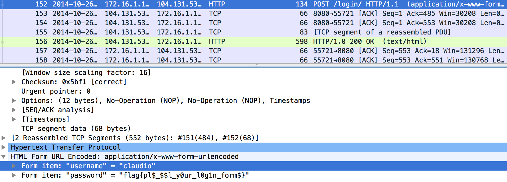

# Pico CTF 2014 : Intercepted Post

**Category:** Forensics
**Points:** 40
**Description:**

>We intercepted some of your Dad's web activity. Can you get a password from his traffic?. You can also view the traffic on CloudShark.

**Hint:**
>Login is usually done through a POST request. Then, depending on what characters are in Claudio's password, they may be specially encoded...

## Write-up

Opening the pcap traffic dump with `wireshark`, we look for a HTTP `POST` and find it in the last section of the intercepted packages:

The flag is `flag{pl$_$$l_y0ur_l0g1n_form$}`.

## Other write-ups and resources

* <http://ehsandev.com/pico2014/forensics/intercepted_post.html>
