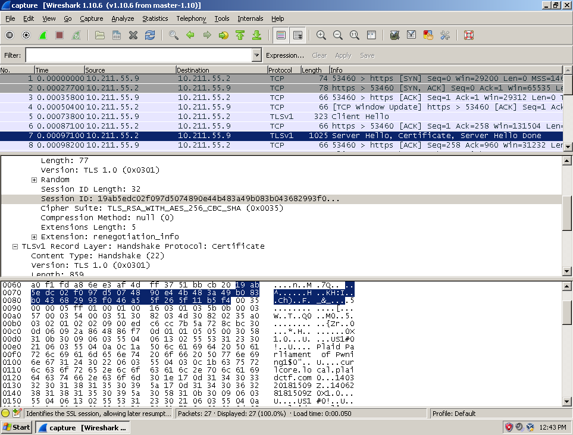
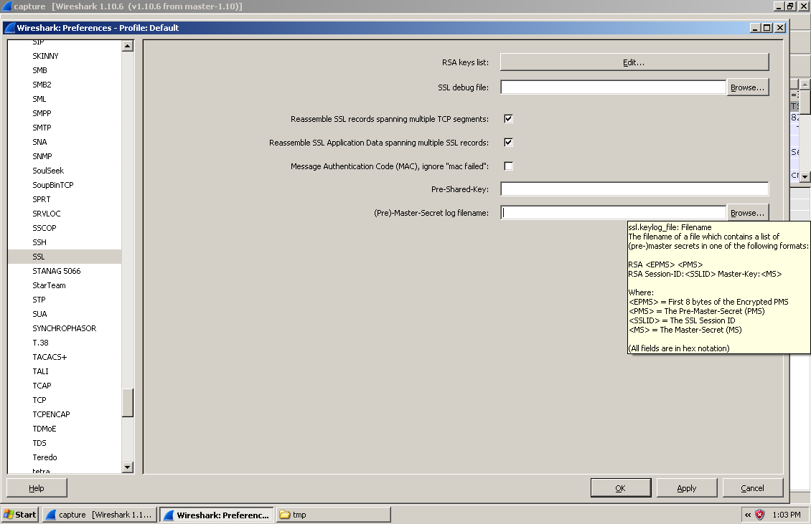
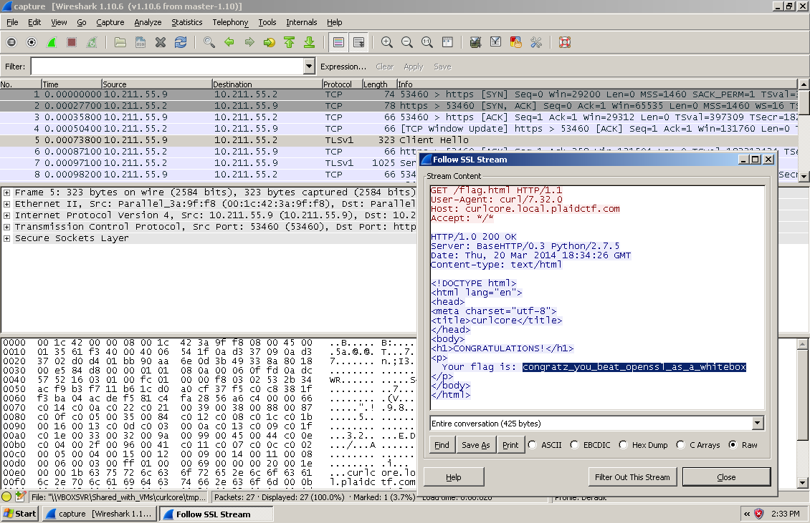

# Plaid CTF 2014: curlcore

**Category:** Forensics
**Points:** 250
**Description:**

> We managed to grab a [memory dump](curlcore-b9b2bc016a796db9db66be6365d48a6b.tar.bz2) off of The Plague’s computer while he was making a secure download. We think he may have been looking for new places to hide the Prime Factorizer. Can you figure out what messages were sent through his computer?

## Write-up

Unzip [the provided tarball](curlcore-b9b2bc016a796db9db66be6365d48a6b.tar.bz2). This results in the following file/directory structure:

```bash
$ tree
.
├── curlcore.sh
├── lib
│   └── x86_64-linux-gnu
│       ├── ld-2.17.so
│       ├── libc-2.17.so
│       ├── libcom_err.so.2.1
│       ├── libcrypt-2.17.so
│       ├── libcrypto.so.1.0.0
│       ├── libdl-2.17.so
│       ├── libgcrypt.so.11.7.0
│       ├── libgpg-error.so.0.10.0
│       ├── libkeyutils.so.1.4
│       ├── libnsl-2.17.so
│       ├── libnss_compat-2.17.so
│       ├── libnss_files-2.17.so
│       ├── libnss_nis-2.17.so
│       ├── libpthread-2.17.so
│       ├── libresolv-2.17.so
│       ├── libssl.so.1.0.0
│       └── libz.so.1.2.8
├── tmp
│   ├── capture
│   ├── corefile
│   └── coremaps
└── usr
    ├── bin
    │   └── curl
    └── lib
        └── x86_64-linux-gnu
            ├── libasn1.so.8.0.0
            ├── libcurl.so.4.3.0
            ├── libgnutls.so.26.22.6
            ├── libgssapi.so.3.0.0
            ├── libgssapi_krb5.so.2.2
            ├── libhcrypto.so.4.1.0
            ├── libheimbase.so.1.0.0
            ├── libheimntlm.so.0.1.0
            ├── libhx509.so.5.0.0
            ├── libidn.so.11.6.11
            ├── libk5crypto.so.3.1
            ├── libkrb5.so.26.0.0
            ├── libkrb5.so.3.3
            ├── libkrb5support.so.0.1
            ├── liblber-2.4.so.2.8.3
            ├── libldap_r-2.4.so.2.8.3
            ├── libp11-kit.so.0.0.0
            ├── libroken.so.18.1.0
            ├── librtmp.so.0
            ├── libsasl2.so.2.0.25
            ├── libsqlite3.so.0.8.6
            ├── libtasn1.so.3.2.0
            └── libwind.so.0.0.0

7 directories, 45 files
```

`curlcore.sh` is a shell script that was used to create the tarball. It contains this piece of code:

```bash
sleep 1
OUTPUT="`/usr/bin/env -i /bin/dash -c 'ulimit -c unlimited; curl -k https://curlcore.local.plaidctf.com/flag.html & PID=$!; sleep 5; printf "generate-core-file\ninfo proc mappings\ndetach\n" | sudo gdb attach $PID; wait'`"
sleep 1
```

Apparently, `https://curlcore.local.plaidctf.com/flag.html` was requested while the dump was created. The flag we’re looking for is probably part of the response.

Open `tmp/capture` in Wireshark. It shows that `https://curlcore.local.plaidctf.com/flag.html` was indeed requested, but since it was downloaded over HTTPS the plain text response isn’t available as part of the capture. We _do_ know that `TLS_RSA_WITH_AES_256_CBC_SHA` is used, i.e. the data is encrypted with AES-256 and the key is exchanged using basic RSA encryption. Wireshark also displays the RSA session ID, `19AB5EDC02F097D5074890E44B483A49B083B043682993F046A55F265F11B5F4`:



Now that we have the session ID, [we could decrypt the entire session if we also had the SSL master secret](http://www.cloudshield.com/blog/advanced-malware/how-to-decrypt-openssl-sessions-using-wireshark-and-ssl-session-identifiers/):



But where could we find this SSL master key? `curl` depends on OpenSSL for TLS support… So [let’s see how OpenSSL stores the SSL master key in memory](https://github.com/openssl/openssl/blob/300b9f0b704048f60776881f1d378c74d9c32fbd/ssl/ssl.h#L586-L590).

```h
struct ssl_session_st
  {
  // […]
  int master_key_length;
  unsigned char master_key[SSL_MAX_MASTER_KEY_LENGTH];
  /* session_id - valid? */
  unsigned int session_id_length;
  unsigned char session_id[SSL_MAX_SSL_SESSION_ID_LENGTH];
  // […]
}
```

Turns out the SSL master key is close to the session ID, in the same struct.

Let’s see if the session ID occurs in any of the other files:

```bash
$ grep '\x19\xAB\x5E\xDC\x02\xF0\x97\xD5\x07\x48\x90\xE4\x4B\x48\x3A\x49\xB0\x83\xB0\x43\x68\x29\x93\xF0\x46\xA5\x5F\x26\x5F\x11\xB5\xF4' -r .
Binary file ./tmp/capture matches
Binary file ./tmp/corefile matches
```

A-ha, `tmp/corefile` also contains the session ID. Let’s look near the session ID in this file, for anything that might be the SSL master key for the connection.

```bash
$ hexdump -C tmp/corefile | grep --before=5 --after=3 '19 ab 5e dc'
0004fbc0  20 20 00 00 00 00 00 00  70 01 00 00 00 00 00 00  |  ......p.......|
0004fbd0  01 03 00 00 00 00 00 00  00 00 00 00 00 00 00 00  |................|
0004fbe0  30 00 00 00 19 1e 50 42  e6 b3 13 71 aa 65 25 8e  |0.....PB...q.e%.|
0004fbf0  13 b2 dc 71 4d 98 4d f8  d6 8f ad 67 8f f0 a2 fc  |...qM.M....g....|
0004fc00  49 47 6d 65 c3 a1 61 f7  18 57 2c 3f 5d b8 56 6a  |IGme..a..W,?].Vj|
0004fc10  0d e8 9e 58 20 00 00 00  19 ab 5e dc 02 f0 97 d5  |...X .....^.....|
0004fc20  07 48 90 e4 4b 48 3a 49  b0 83 b0 43 68 29 93 f0  |.H..KH:I...Ch)..|
0004fc30  46 a5 5f 26 5f 11 b5 f4  00 00 00 00 00 00 00 00  |F._&_...........|
0004fc40  00 00 00 00 00 00 00 00  00 00 00 00 00 00 00 00  |................|
```

And indeed: right before the session ID, starting with `19 1e 50 42` and ending with `0d e8 9e 58` there is something that might be a valid master key (consisting of exactly `96` hexadecimal digits).

Let’s write the session ID and this master key to [a file in the format described by Wireshark](session-master-secret.log):

```
RSA Session-ID:19AB5EDC02F097D5074890E44B483A49B083B043682993F046A55F265F11B5F4 Master-Key:191E5042E6B31371AA65258E13B2DC714D984DF8D68FAD678FF0A2FC49476D65C3A161F718572C3F5DB8566A0DE89E58
```

Go to Wireshark → Edit → Preferences → Protocols → SSL and select the `session-master-secret.log` file in the (Pre-)Master-Secret log filename input field.

After that, you can right-click on any TLS/SSL packet and select ‘Follow SSL Stream’ to view the decoded payload.



The flag is `congratz_you_beat_openssl_as_a_whitebox`.

## Other write-ups and resources

* <https://cesena.ing2.unibo.it/2014/04/14/plaidctf-2014-curlcore-forensic-250/>
* <https://fail0verflow.com/blog/2014/plaidctf2014-for250-curlcore.html>
* <https://docs.google.com/a/google.com/file/d/0B1Q3-q0eaImNSlNJbTNKVzNtV3c/edit>
* [Source code for this challenge, released after the CTF](https://github.com/pwning/plaidctf2014/tree/master/forensics/curlcore)
* [Indonese](http://blog.rentjong.net/2014/04/plaidctf2014-write-up-curlcore.html)
* <http://j00ru.vexillium.org/dump/ctf/curlcore.zip>
