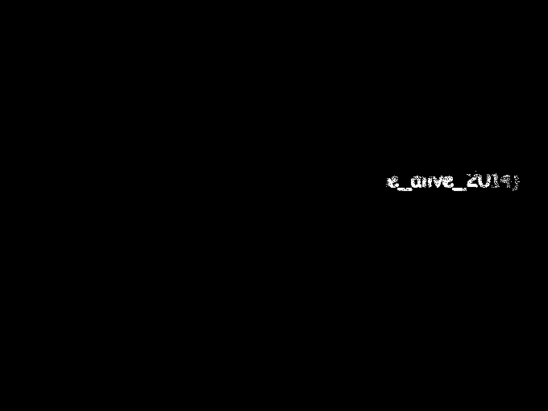
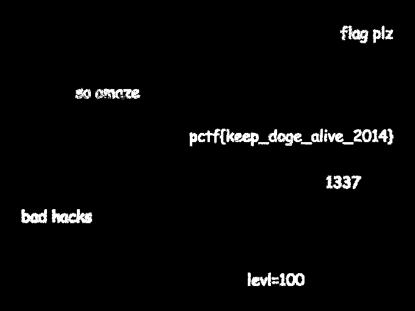

# Plaid CTF 2014: doge_stege

**Category:** Forensics
**Points:** 100
**Description:**

> You were startled to learn the The Plague has been behind many of the most popular internet memes. We believe he hides information in these funny pictures with steganography in order to broadcast his messages through time without detection. Find the [hidden message](doge_stege-bcea78ed7ce3588f89b56f125866c1e2.tar.bz2), stop the signal.

## Write-up

_This write-up is made by Steven of the [HacknamStyle](http://hacknamstyle.net/) CTF team._

Inspecting the PNG shows:

```bash
$ file doge_stege.png
doge_stege.png: PNG image data, 680 x 510, 8-bit colormap, non-interlaced
```

An 8-bit colormap is a typical place where things are hidden in a steganography challenge. After some lazy searching, we find a tool to change the palette (or colormap) of a PNG using Python [on Stack Overflow](http://stackoverflow.com/a/1214765/96656).

[`change_palette.py`](change_palette.py) is modified to allow us to write out 256 images, each one highlighting a single entry in white while blacking out the others:

```bash
$ for i in {0..255}; do ./change_palette.py doge_stege.png "single-color-${i}.png" "${i}"; done
```

All the resulting images can be found in [`single.tar.gz`](single.tar.gz). Going through these images, we notice that on `single-color-127.png`, some unseen text appears:



Other images show similar fragments of text. Clearly, the message is composed of multiple entries in the colormap. [`change_palette.py`](change_palette.py) is modified again (uncomment the correct line) to now highlight a range of colormap entries starting from `127` onwards:

```bash
$ for i in {0..128}; do ./change_palette.py doge_stege.png "range-color-127+${i}.png" "${i}"; done
```

All these images can be found in [`range.tar.gz`](range.tar.gz). In e.g. `range-color-127+54.png`, the full message becomes readable:



The flag is `pctf{keep\_doge\_alive\_2014}`.

## Other write-ups and resources

* <https://ucs.fbi.h-da.de/writeup-plaidctf-2014-doge-stege/>
* <http://csrc.tamuc.edu/css/?p=156>
* <https://cesena.ing2.unibo.it/2014/04/14/plaidctf-2014-doge_stege-forensic-100/>
* <https://fail0verflow.com/blog/2014/plaidctf2014-for100-doge_stege.html>
* <https://github.com/hackerclub/writeups/blob/master/plaidctf-2014/doge_stege/WRITEUP-pipecork.md>
* <https://ucs.fbi.h-da.de/writeup-plaidctf-2014-doge-stege/>
* [Indonese](http://blog.rentjong.net/2014/04/plaidctf2014-write-up-dogestege.html)
