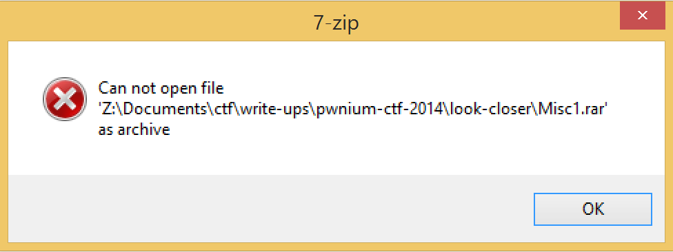

# Pwnium CTF 2014: Look closer

**Category:** Misc
**Points:** 50
**Description:**
> [http://41.231.53.40/Misc1.rar](Misc1.rar)

## Write-up

We are given the `Misc1.rar` file that fails to get open as an archive

If we run `file` command it is actually identified as `JPEG` file

> Misc1.rar: JPEG image data, JFIF standard 1.01, comment: "CREATOR: gd-jpeg v1.0 (using IJ"

Lets give a file proper extension

> mv Misc1.rar Misc1.jpeg

and open it. If we look close enough, we can read the flag:

so the flag is: 

`Pwnium{361a8212dda49824b8fdb70ce48f2f60}`
## Other write-ups

