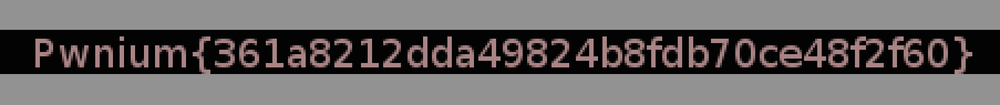

# Pwnium CTF 2014: Look closer

**Category:** Misc
**Points:** 50
**Description:**

> [http://41.231.53.40/Misc1.rar](Misc1.rar)

## Write-up

We are given the `Misc1.rar` file that fails to open as an archive. If we run the `file` command it is actually identified as `JPEG` file:

```bash
$ file Misc1.rar
Misc1.rar: JPEG image data, JFIF standard 1.01, comment: "CREATOR: gd-jpeg v1.0 (using IJ"
```

Let’s give it a proper file extension:

```bash
$ mv Misc1.rar Misc1.jpeg
```

…and open it. If we look close enough, we can read the flag:



The flag is:

```
Pwnium{361a8212dda49824b8fdb70ce48f2f60}
```

## Other write-ups and resources

* <https://ctftime.org/writeup/1157>
* <https://crazybulletctfwriteups.wordpress.com/2014/07/07/pwnium-ctf-2014-look-closer/>
