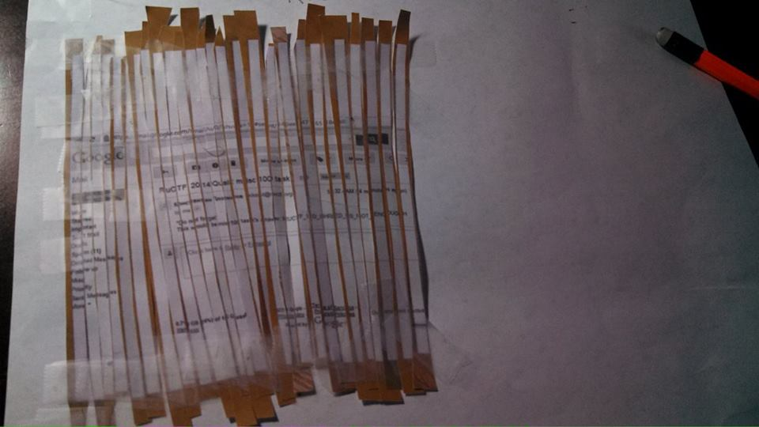

# RuCTF 2014 Quals: Misc 100 - [Shredder](https://github.com/HackerDom/ructf-2014-quals/tree/master/tasks/shredder)

> [Find the key](shredder.af3ab921a9895c1aa9c032a37677e1d7.jpg)
> Flag format is "RUCTF\_.\*"

## Writeup

The easiest way to approach this is to go old-school and do it by hand. After a bit of tedious work, it should look something like this:

The flag is `RUCTF_TO_SHRED_IS_NOT_ENOUGH`.

## Other write-ups and resources

* <http://nullify-ctf.blogspot.in/2014/03/ructf-quals-misc-100-shredder-writeup.html>
* <https://ctfcrew.org/writeup/40>
* [Japanese](http://d.hatena.ne.jp/kusano_k/20140310/1394471922)
* <http://lights-out-ctf.ghost.io/ructf-2014-quals-misc-100-shredder-misc-200-ructf-radio/>
* <http://www.suslopas.pw/2014/03/ructf-misc-100.html>
