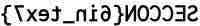

# SECCON CTF 2014: Reverse it

**Category:** Binary
**Points:** 100
**Description:**

> [`Reverseit`](Reverseit)

## Write-up

Let’s take the challenge name literally and reverse the hexadecimal representation of the bytes in the file:

```bash
$ xxd -p Reverseit | tr -d '\n' | rev | xxd -r -p > reversed

$ file reversed
reversed: JPEG image data, JFIF standard 1.01
```

The result is a JPEG image that displays a horizontally flipped (“reversed”) version of the flag:



The flag is `SECCON{6in_tex7}`.

## Other write-ups and resources

* <http://tasteless.eu/2014/12/seccon-ctf-2014-online-qualifications-reverseit-writeup/>
* <http://blogs.univ-poitiers.fr/e-laize/2014/12/07/seccon-2014-reverseit/>
