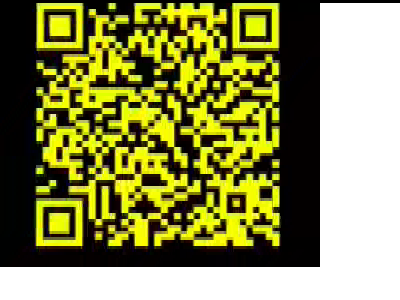

# SECCON CTF 2014: SECCON Wars: The Flag Awakens

**Category:** QR
**Points:** 300
**Description:**

> <http://youtu.be/1pC56S17-_A>
>
> # Not need Japanese text to solve this task.
> # If you need it? see below :)
> <http://pastebin.com/uXByBZv5>

## Write-up

The challenge links to a YouTube video: <https://www.youtube.com/watch?v=1pC56S17-_A>.

A bunch of Japanese text is displayed, but the description of the challenge told us that we weren’t required to understand it. At 56 seconds from the start of the video, the SECCON logo stands in front of the text, and we can see a QR code sliding in the background.

So, I recorded the frames of the video using VLC. To do so, you have to click on _Tools_ → _Preferences_, set the settings to _All_ and in the section _Video_, click _Filters_ and enable _Scene video filter_. Then under the _Filters_ menu click _scene filter_ to configure it. I configured it to save every frame, and started to play the video at the begining of the appearance of the QR code.

Once this was done, I wrote a small Python script to create an image combining the last line of pixels from every frame.

```python
import subprocess
from PIL import Image

width = 400
height = 300
result = Image.new('RGBA', (width, height))

img_list = subprocess.check_output(['ls', './']).split(b'\n')
i = 0
for img in img_list:
  if img[-4:] != b'.png':
    continue
  image = Image.open(img.decode('utf-8'))
  rgb_im = image.convert('RGB')
  for x in range(image.size[0]):
    for y in range(3):
      r, g, b = rgb_im.getpixel((x, image.size[1] - 1))
      result.putpixel((x, i + y),(r, g, b, 255))
    i += 3
result.save('result.png')
```

Running this script in the same directory where the saved frames are results in the following picture:



…which should scan properly with almost any QR code reader, but I saw that some online QRcode reader couldn’t read it (because of the colors I guess) so after a few Gimp manipulations, I ended up with this:


The flag is `SECCON{M4Y 7H3 F0RC3 83 W17H U}`.

## Other write-ups and resources

* <http://blog.pnuts.tk/2014/12/seccon-qr300.html>
* [Portuguese](https://ctf-br.org/wiki/seccon/seccon2014/f300-seccon-wars-the-flag-awakens/)
