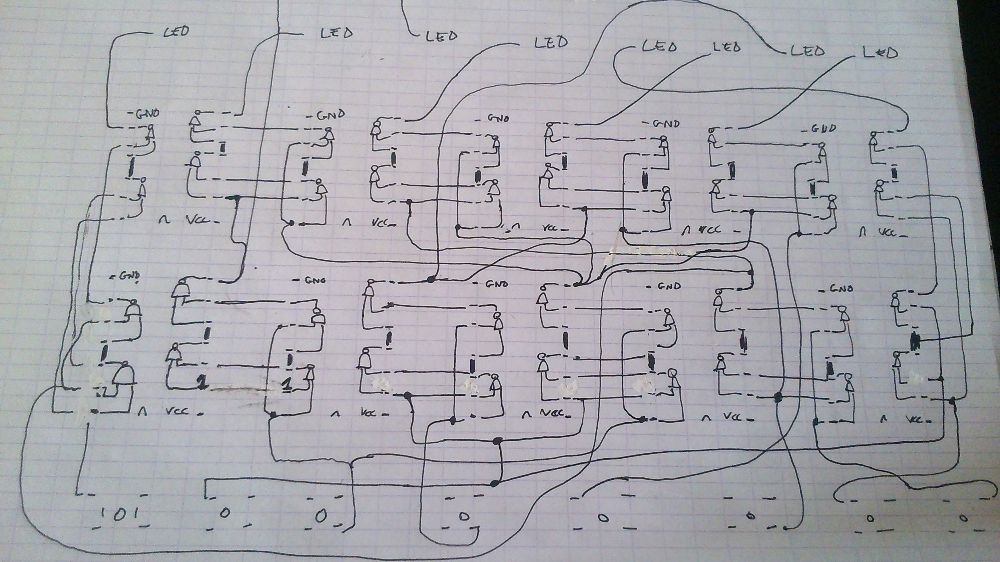

# SECCON CTF 2014: The Golden Gate

**Category:** Programming
**Points:** 400
**Description:**

> We’ve found an encoder board along with cipher text. Please help us to decrypt it.
>
> The cipher text: `BQDykmgZ0I6SaQnq4o/iEONudetXdPJdpl1UVSlU69oZOtvqnHfinOpcEfIjXy9okkVpsuw2kpKS==`
>
> Main: [encoder board photos (Google Drive)](https://drive.google.com/a/seccon.jp/folderview?id=0B1HyMpKFOlLZRXc0YVNTX2E0dU0&usp=sharing)
> Mirror: [`encoder_board_photos.zip`](encoder_board_photos.zip)

## Write-up

This challenge is fairly straightforward: you are given some pictures of an encoder board and a ciphertext. To solve this challenge, you need to understand the encoder board and reverse-engineer it to decrypt the ciphertext. But understanding the encoder board was a bit tricky due to many wires crossing each other and some sneaky use of pull-up and pull-down inputs. First things first, we need to know what the chips are on the board, but luckily we can clearly see the name and a quick Google search for a [datasheet gives us the information we need](TC74HC00_Datasheet.pdf). The chip they used is a “quad 2-input nand gate”. This means that in each chip there are four NAND gates and each NAND gate has two inputs and one output. In the data sheet you can see the assignation of each pin. The next step is to map the wires and the solderings so that you can see what each input/button does to the leds. This is the tedious part of the challenge but below you can see an image of the map I made.



If we study the map we can see that all the chips are [wired in the same way](http://upload.wikimedia.org/wikipedia/commons/f/fa/XOR_from_NAND.svg). That wiring can be reduced to a simple xor gate. The XOR function is associative and commutative. This gives us the following functions for the leds (outputs of the encoder board).

```
led1 = XOR(button1, button6, button8)
led2 = !button2 (This is the simplification of XOR(!button3, button3, button2))
led3 = !button3 (XOR'ing with 1 is the same as a NOT)
led4 = XOR(button2, button3, button6, button8)
led5 = XOR(button2, button7)
led6 = XOR(button2, button4, button6)
led7 = XOR(button2, button4)
led8 = XOR(button2, button3, button5)
```

Reversing this is — luckily for us — not that complicated since the reverse of a XOR is applying the same XOR. Which gives us the following equations for the buttons (inputs of the decoder) in function of the leds (outputs of the decoder).

```
button3 = !led3
button2 = !led2
button4 = XOR(button2, led7)
button7 = XOR(button2, led5)
button5 = XOR(button2, button3, led8)
button6 = XOR(button2, button4, led6)
button8 = XOR(button2, button3, button6, led4)
button1 = XOR(button6, button8, led1)
```

Note that for `button4` and `button7` you need to know the state of `button2`; for `button5` you need to know `button2` and `button3`, etc. Now that we have decoded the encoder board we can decrypt our cipher. Since we have exactly 8 inputs and 8 outputs we can assume the encoder was used to encrypt each byte of the cipher text. But as I said in the beginning there are some sneaky uses of pull-up inputs and pull-down inputs. The leds are wired to `vcc` so our output from the gates need to be `gnd` or `0`. This means we need to invert each byte before we decrypt. Another sneaky thing is that buttons 1, 2, 5, 7 are in a pull-up position which is to say when you don’t press the button (your input equals `0`) it will send a `1` to the gates. So we need to invert these buttons/bits after the decryption. I used [a script](goldengate.py) to decode the base64 string (which gives us our real ciphertext) and then decode the ciphertext to the plain text. The result isn’t something readable but if we look closer at the first bytes we can see that this is a header for gzip-compressed data (hex values: `1f 8b`). Unzipping the file results in a text file containing the flag.

The flag is `SECCON{Hlvd0toiXgloBhTM}`.

## Other write-ups and resources

* <https://gist.github.com/libmaru/b9bf5926aed97084b111>
