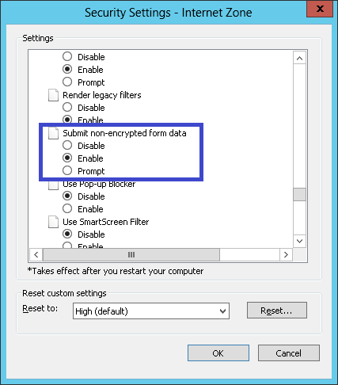

# SECCON CTF 2014: XSS Bonsai (aka. Hakoniwa XSS Reloaded)

**Category:** Web
**Points:** 500
**Description:**

> [`bonsaiXSS.zip`](bonsaiXSS.zip)
>
> This challenge has 2 answers (2 steps).
> If you collect 2 answers, you can get full points (500pts).
>
> [#9 About “XSS Bonsai” Runtime Environment]
>
> There is a problem when running Bonsai XSS, in that you can run the program but it will not correctly proceed past the first stage. However, it should work if you install Visual Studio Express 2013 Web (evaluation) or other versions of Visual Studio. We are sorry for the inconvenience but please install Visual Studio to fix this. You can test it by putting…
>
> ```
> ";alert('XSS');//
> ```
>
> …in stage 1. If you get a “Congratulations” alert box and pass to stage 2 then your environment is working. Good luck!
>
> [#10 About “XSS Bonsai” Runtime Environment 2]
>
> If you press the send button and nothing happens, please check and change IE Security Settings — Internet Zone as shown below.
>
> 

## Write-up

(TODO)

## Other write-ups and resources

* <https://gist.github.com/tyage/e813031d14b39bfe3133>
* <https://rzhou.org/~ricky/seccon2014/xss_bonsai/>
