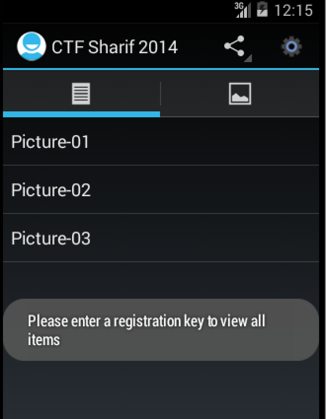
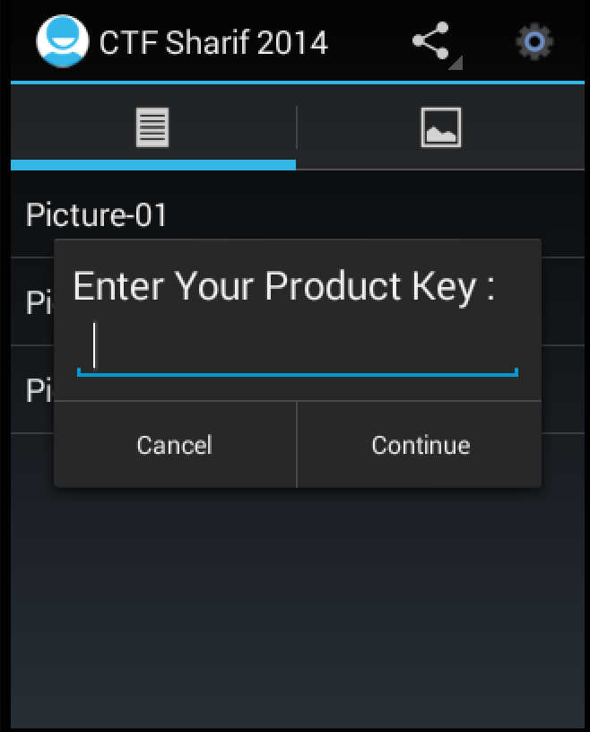

# Sharif University Quals CTF 2014: Commercial Application

**Category:** Reverse
**Points:** 200
**Solves** 132
**Description:**

> Flag is a serial number.
>
> [Download](suCTF.apk)

## Write-up

We are given an Android application file `suCTF.apk` and have to look for a serial number, according to the description.

Let's first run it, using an Android Virtual Device and the `adb` tool:

```bash
$ android avd &
$ abd install suCTF.apk
5139 KB/s (1653085 bytes in 0.314s)
	pkg: /data/local/tmp/suCTF.apk
Success
```

We can click on various elements named `Picture-0`, `Picture-1` and `Picture-2` and see an alert box (Toast) when clicking on the latter two elements:



If we click on the settings button, we have to insert a Product Key, which might be the serial number the description is talking about.



So let's reverse `suCTF.apk`, e.g. with an advanced decompiler like [jadx](https://github.com/skylot/jadx) for a good dex to java conversion as well as `apktool` to get everything else, e.g. the resources and the manifest [AndroidManifest.xml](AndroidManifest.xml).

In the manifest, we can see the main entry point, which is [MainActivity.java](MainActivity.java).

In this class, we can see two Strings `NOK_LICENCE_MSG` and `OK_LICENCE_MSG`, which are the response texts after inserting an incorrect or correct serial number. The corresponding switch code is in line 59-65 of `MainActivity.java`, an onClick function of the Button we have to press, when entering a Product key.

The check is done with another class, [KeyVerifier.java](KeyVerifier.java) using it's `isValidLicenceKey` function, which uses three parameters:

	* The user input `userInput`, which is the proposed serial number
	* A secret security key
	* A secret security IV

The function checks if `userInput`, encrypted with an AES-128-CBC cipher using the secret key and iv, is equal to the static licence `VALID\_LICENCE`. This leads to the conclusion that we have to decrypt the licence to get the serial number.

So how do we get the secret key and iv?

The class [AppConfig.java](AppConfig.java) provides the Setter and Getter methods for those secrets. The former methods are called in the [DbHelper.java](DBHelper.java) class:

```
DB_PATH = "/data/data/edu.sharif.ctf/databases/";
DB_NAME = "db.db";
TABLE_NAME = "config";
SELECT_QUERY = "SELECT  * FROM " + TABLE_NAME + " WHERE a=1";
[...]
AppConfig agency = new AppConfig();
Cursor cursor = this.myDataBase.rawQuery(SELECT_QUERY, null);¶
[...]
agency.setSecurityIv(cursor.getString(IcsLinearLayout.SHOW_DIVIDER_END));
gency.setSecurityKey(cursor.getString(FragmentManagerImpl.ANIM_STYLE_FADE_ENTER));
```

`IcsLinearLayout.SHOW\_DIVIDER\_END` and `FragmentManagerImpl.ANIM\_STYLE\_FADE\_ENTER` here are constants, `4` and `5`.

So what this code essentially does is getting the 5th and 6th fields of the `column` table in the `db.db` databases located at `/data/data/edu.sharif.ctf/databases/` and using it as the secret iv (5th field) and secret key (6th field).

Let's get the database with `adb pull /data/data/edu.sharif.ctf/databases/db.db` and analyse [db.db](db.db):

```bash
$ sqlite3 -cmd '.headers ON' db.db <<< '.tables'
config
$ sqlite3 -cmd '.headers ON' db.db <<< 'select * from config;'
a|b|c|d|e|f|g|h|i
1|2|2014|0|a5efdbd57b84ca36|37eaae0141f1a3adf8a1dee655853714|1000|ctf.sharif.edu|9
```

This shows us that the secret key is `37eaae0141f1a3adf8a1dee655853714` and the secret iv is `a5efdbd57b84ca36`.

We can then decrypt the licence and get the flag, e.g. by using [this code](keym.java).

```bash
$ javac keym.java && java keym | xxd -r -p && echo
fl-ag-IS-se-ri-al-NU-MB-ER
```

The flag is `fl-ag-IS-se-ri-al-NU-MB-ER`.
## Other write-ups and resources

* <http://ctf.sharif.edu/2014/quals/su-ctf/write-ups/25/>
