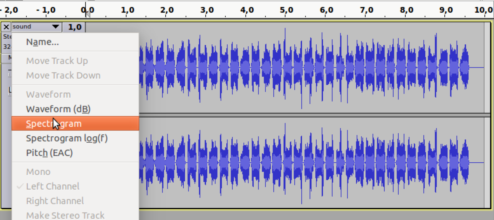

# Sharif University Quals CTF 2014: Hear with your Eyes

**Category:** Steganography
**Points:** 100
**Solves** 172
**Description:**

> Hear With Your Eyes
>
> [Download](sound.wav.tar.gz)

## Write-up

We are given a WAVE audio file, `sound.wav`:

```
$ file sound.wav
sound.wav: RIFF (little-endian) data, WAVE audio, Microsoft PCM, 16 bit, stereo 44100 Hz
```

The title says to "hear with your eyes", so we use audacity to look at the spectrum of frequencies in that file using the `spectogram` feature.



And we get the flag `e5353bb7b57578bd4da1c898a8e2d767`:


## Other write-ups and resources

* <http://ctf.sharif.edu/2014/quals/su-ctf/write-ups/19/>
