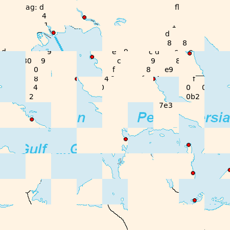
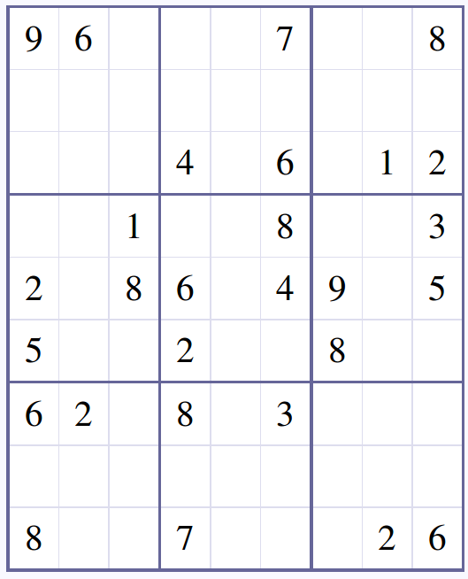
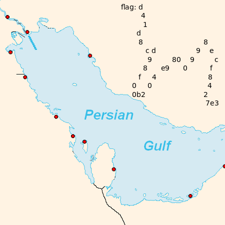

# Sharif University Quals CTF 2014: Sudoku Image Encryption

**Category:** Cryptography
**Points:** 40
**Solves** 169
**Description:**

> Row Major Order
>
> [Download](row-major-order.tar.gz)

## Write-up

We are given two images:




Noticing the title "Row Major Order" and having a sudoku to solve, we come to the conclusion that we have to rearrange the picture fragments (of size `50x50` pixels) by row given the [solution](solution) of the sudoku.

The following [script](defrag) just does this:

```
#!/bin/bash
mkdir in out result
for i in {1..9}; do
	for j in {1..9}; do convert -extract 50x50+$(($((j-1))*50))+$(($((i-1))*50)) image.png in/a$i-$j.png; done
	COUNT=1
	sed "${i}q;d" solution | grep --color=none -o . | while read n; do
		cp in/a$i-$COUNT.png out/a$i-$n.png; COUNT=$((COUNT+1))
	done
	convert +append out/a$i-{1..9}.png result/out$i.png
done

for i in {1..9}; do convert -append result/out{1..9}.png flag.png; done
```

The resulting `flag.png`:



Success! Our flag is `d41d8cd98f00b204e9800998ecf8427e3`.
## Other write-ups and resources

* <http://ctf.sharif.edu/2014/quals/su-ctf/write-ups/16/>
