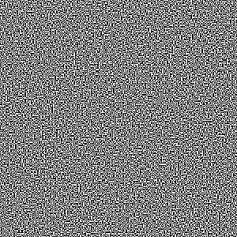
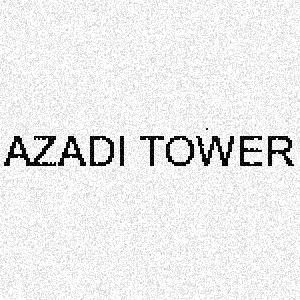

# Sharif University Quals CTF 2014: What is this

**Category:** Steganography
**Points:** 20
**Solves** 308
**Description:**

> Find the flag!
>
> [Download](what-is-this.tar.gz)

## Write-up

We are given two pictures:

Using a stegonagraphy tool like [stegsolve](http://www.wechall.net/forum/show/thread/527/Stegsolve\_1.3/page-1), we combine both pictures by XORing them. The result is this picture, containing the `AZADI TOWER` flag:

## Other write-ups and resources

* <http://ctf.sharif.edu/2014/quals/su-ctf/write-ups/11/>
