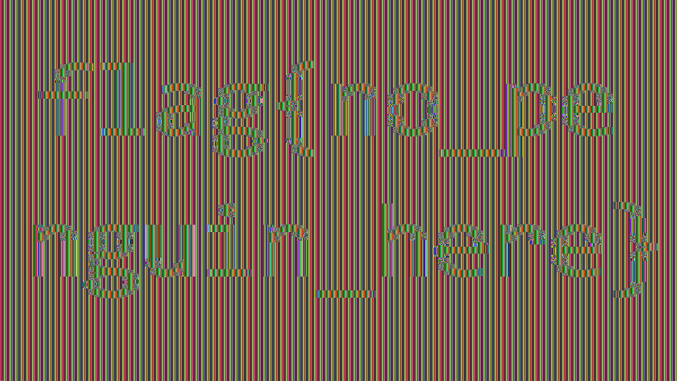

# tinyCTF 2014: ECB, it’s easy as 123

**Category:** Crypto
**Points:** 300
**Description:**

> [Download file](cry300.zip)

## Write-up

Let’s extract the provided `cry300.zip` file:

```bash
$ unzip cry300.zip
Archive:  cry300.zip
  inflating: cry300
```

The extracted `cry300` file is another ZIP archive:

```bash
$ file cry300
cry300: Zip archive data, at least v2.0 to extract
```

So let’s unzip it as well:

```bash
$ unzip cry300
Archive:  cry300
  inflating: ecb.bmp
  inflating: task.txt
```

The extracted `task.txt` file says:

> Somebody leaked a still from the upcoming Happy Feet Three movie,
> which will be released in 4K, but Warner Bros. was smart enough
> to encrypt it. But those idiots used a black and white bmp format,
> and that wasn't their biggest mistake. Show 'em who's boss and
> get the flag.

The BMP file is not actually a valid image file because it is encrypted. Its first few bytes are interesting:

```bash
$ hexdump -C ecb.bmp | head -n2
53 61 6c 74 65 64 5f 5f  ab 31 b5 e5 ca 3d b9 4d  |Salted__.1...=.M|
```

The `Salted__` prefix indicates this file is [encrypted using OpenSSL](http://justsolve.archiveteam.org/wiki/OpenSSL_salted_format). The next 8 bytes (`ab 31 b5 e5 ca 3d b9 4d`) are the salt that was used to encrypt the file. The rest of the file is the encrypted data.

There are a few hints in the title and the task description:

* ECB – ECB encryption is notoriously bad for images because the same plaintext block results in the same ciphertext
* 4K resolution – this tells us the image is either 3840×2160 or 4096×2160 pixels
* black and white – we will most likely see a lot of white-only blocks

With this in mind, let’s take a look at the hex dump:

```bash
$ xxd ecb.bmp | head -n 13
0000000: 5361 6c74 6564 5f5f ab31 b5e5 ca3d b94d  Salted__.1...=.M
0000010: f409 1aa5 df88 b72c 0ebd 8a73 9815 ba69  .......,...s...i
0000020: a224 3e09 94cb 791e eaa1 ad33 c817 6663  .$>...y....3..fc
0000030: 7898 230b f0af 2038 f1aa 0bf4 691c eccf  x.#... 8....i...
0000040: fcd8 8e3d 452a 99b0 536b 500d 8a3d c4b7  ...=E*..SkP..=..
0000050: 629c 6a54 f059 2013 224f b6e2 b6aa 0a8b  b.jT.Y ."O......
0000060: 5e21 1a9d cf8c a2f6 4580 cb9b b737 da7f  ^!......E....7..
0000070: 7350 88cb df63 ee22 d424 b3b9 f424 ad40  sP...c.".$...$.@
0000080: 2f09 e681 9bb5 1388 01fa 0a47 7809 6523  /..........Gx.e#
0000090: 323f 8b1e b820 9c99 fcb5 4601 0bc9 4134  2?... ....F...A4
00000a0: 323f 8b1e b820 9c99 fcb5 4601 0bc9 4134  2?... ....F...A4
00000b0: 323f 8b1e b820 9c99 fcb5 4601 0bc9 4134  2?... ....F...A4
00000c0: 323f 8b1e b820 9c99 fcb5 4601 0bc9 4134  2?... ....F...A4
```

Clearly those are blocks of pixels with the same color. Now we could write a script to solve this task. This script would create an image where every 16 pixel block would be black or white, depending on whether the corresponding encrypted block is the same as the most frequent block (`32 3f 8b 1e …`).

There is an even better solution though. We can simply remove the first 16 bytes (`Salted__` and the salt) and then replace the first few bytes in the ciphertext with a valid BMP header. This works because BMPs store raw data and we won’t get invalid blocks.

To get a valid BMP header for this particular image size, the easiest solution is to create a BMP. When we create a BMP with the right size, we notice a problem right away. The image size is way bigger than the payload (24 MB vs. 4 MB). After some tinkering we realize that the image had 16-bit color depth instead of 24. We also learn the correct resolution (3840×2160 instead of 4096×2160), because the sizes must match perfectly (except there is a 16-byte header and up to 16 bytes of padding at the end). Now we can do the surgery on the ciphertext with any hex editor program.

Here is the correct header that we will have to “inject”:

```bash
$ xxd sample.bmp | head -n 8
0000000: 424d 7648 3f00 0000 0000 7600 0000 2800  BMvH?.....v...(.
0000010: 0000 000f 0000 7008 0000 0100 0400 0000  ......p.........
0000020: 0000 0048 3f00 0000 0000 0000 0000 0000  ...H?...........
0000030: 0000 0000 0000 0000 0000 0000 8000 0080  ................
0000040: 0000 0080 8000 8000 0000 8000 8000 8080  ................
0000050: 0000 8080 8000 c0c0 c000 0000 ff00 00ff  ................
0000060: 0000 00ff ff00 ff00 0000 ff00 ff00 ffff  ................
0000070: 0000 ffff ff00 ffff ffff ffff ffff ffff  ................
```

After the surgery, the resulting bitmap is more-or-less readable (converted to PNG and resized to take up less space):



The flag is `flag{no_penguin_here}`.

## Other write-ups and resources

* <https://github.com/jesstess/tinyctf/blob/master/ecb/ecb.md>
* <http://barrebas.github.io/blog/2014/10/03/tinyctf/>
