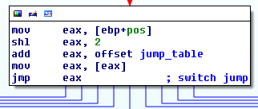

# tinyCTF 2014: Elrond32

**Category:** Reverse Engineering
**Points:** 300
**Description:**

> [Download file](rev300.zip)

## Write-up

Let’s extract the provided `rev300.zip` file:

```bash
$ unzip rev300.zip
Archive:  rev300.zip
  inflating: rev300
```

The extracted `rev300` file is an ELF binary:

```bash
$ file rev300
rev300: ELF 32-bit LSB executable, Intel 80386, version 1 (SYSV), dynamically linked (uses shared libs), for GNU/Linux 2.6.24, stripped
```

We open it in IDA. As usual, the `main` function is the first argument to `___libc_start_main`. Its functionality is simple: if `argv[1]` is present it calls `check_password(argv[1], 0)`. If this check succeeds it calls `print_flag(argv[1])`. Since `print_flag` depends on `argv[1]` we must first reverse `check_password`.

Rename the arguments to get `check_password(password, pos)`. At the beginning of the function it uses a jump table based on `pos`, meaning in the original code a switch statement was used. We have to manually tell IDA this. Go to the `jump eax` instruction, then _Edit_ → _Other_ → _Specify Switch Idiom_. The jump table has 10 elements, each a pointer of size 4 bytes. The default case is located at `0x80484D5`. We end up with a nice layout after this:



Inspecting the function now reveals that in each call the first character is checked (in one of the switch cases). If this character is correct, it recursively calls `check_password(password + 1, newpos)`. Once `pos` equals `2` or `9`, the `default` switch case is hit, which returns `true` (i.e. the password is correct). The final difficulty is finding out how `newpos` is calculated in the recursive call [1]. A commented version is shown in the following image:


The magic constant `0x2E8BA2E9` is used to perform an optimized division by `11`. This optimization technique replaces a constant division by a [multiplication of its reciprocal in fixed-point notation](http://ridiculousfish.com/blog/posts/labor-of-division-episode-i.html). One trick to find out the denominator is to divide `2^32` by the magic constant, and multiply this to match any shift operation like `sar edx, 1`. In this case we have `2^32 / 0x2E8BA2E9 * 2` which equals `1`1. The other arithmetic operations are straightforward. So the value of the new `pos` is (keep in mind that all intermediate results are rounded down):

```c
newpos = (pos + 1) * 7 - [(pos + 1) * 7 / 11 * 11]
```

This is equivalent with:

```c
temp = (pos + 1) * 7
help = temp - (temp % 11)
newpos = temp - help
```

Which can be simplified to:

```c
newpos = temp - help
       = temp - temp + (temp % 11)
       = temp % 11
       = [(pos + 1) * 7] % 11
```

Since the first value of `pos` is `0`, the subsequent values are `7`, `1`, `3`, `6`, `5`, `9`, `4`, and finally `2` (which results in a `default` switch case). Recall that in each of the resulting switch cases, the first character is checked. Hence the password must be `isengard`. This prints out the flag:

```
flag{s0me7hing_S0me7hinG_t0lki3n}
```

[1] Here I decided to explain how to reverse this calculation, since I think this is useful to know. Another approach is to simply step through the execution using a debugger, and dynamically observe which characters are compared to what. This can even be scripted in `gdb`.

### Alternate solution

Using the hint of Elrond, @MajorD4m4ge downloaded a Tolkien dictionary from <http://packetstorm.igor.onlinedirect.bg/Crackers/wordlists/literature/tolkien.gz> and ran:

```bash
$ zcat tolkien.gz | while read line; do ./rev300 "$line"; done | grep -v denied
Access granted
flag{s0me7hing_S0me7hinG_t0lki3n}
```

Running it on `rockyou.txt.gz` eventually revealed the flag as well.

## Other write-ups and resources

* <https://github.com/jesstess/tinyctf/blob/master/elrond32/elrond32.md>
* <http://barrebas.github.io/blog/2014/10/03/tinyctf/>
