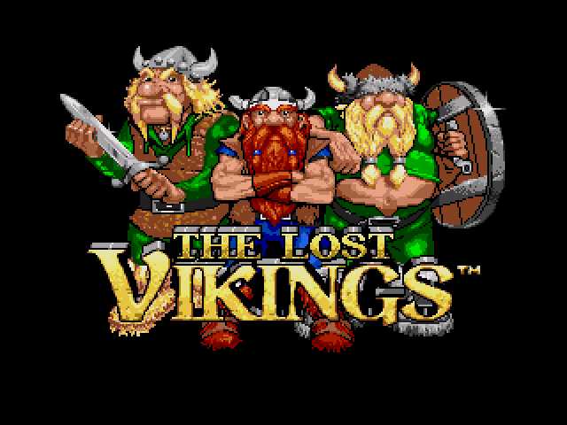
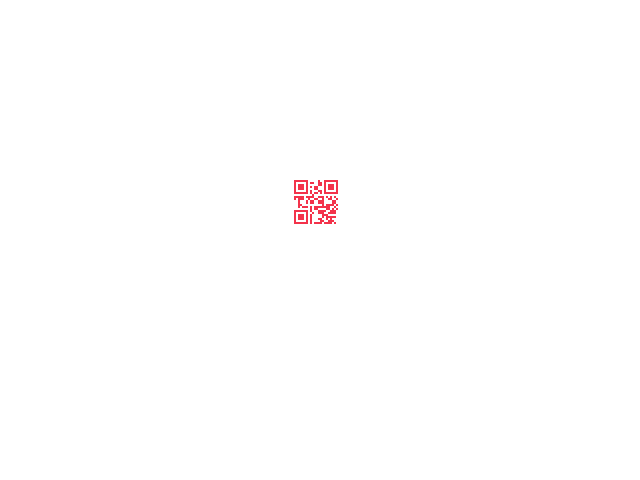

# tinyCTF 2014: Erik, Baleog and Olaf

**Category:** Steganography
**Points:** 100
**Description:**

> [Download file](stego100.zip)

## Write-up

Let’s extract the provided `stego100.zip` file:

```bash
$ unzip stego100.zip
Archive:  stego100.zip
  inflating: stego100
```

The extracted `stego100` file is a PNG image:

```bash
$ file stego100
stego100: PNG image data, 640 x 480, 8-bit/color RGB, non-interlaced
```

Let’s run `pngcheck` on it:

```bash
$ pngcheck -f -v -7 stego100.png
File: stego100.png (26857 bytes)
  chunk IHDR at offset 0x0000c, length 13
    640 x 480 image, 24-bit RGB, non-interlaced
  chunk IDAT at offset 0x00025, length 26753
    zlib: deflated, 32K window, maximum compression
  chunk tEXt at offset 0x068b2, length 35, keyword: hint
    http://i.imgur.com/22kUrzm.png
  chunk IEND at offset 0x068e1, length 0
No errors detected in stego100.png (4 chunks, 97.1% compression).
```

[That hint URL](https://i.imgur.com/22kUrzm.png) is [another image](hint.png) that looks the same:



Let’s diff it with the original `stego100.png` image using [ImageMagick’s `compare` command](http://www.imagemagick.org/script/compare.php):

```bash
$ compare hint.png stego100.png -compose src diff.png
```

[`diff.png`](diff.png) reveals a QR code:



Decoding the QR code gives `flag{#justdiffit}`, which is the flag.

## Other write-ups and resources

* <http://sugarstack.io/tinyctf-steg-100.html>
* <https://poerhiza.github.io/ctf/2014/10/05/tinyCTF-write_ups-erik_baleog_and_olaf/>
* <https://github.com/evanowe/TinyCTF2014-writeups/blob/master/README.md#erik-baleog-and-olaf>
* <https://github.com/jesstess/tinyctf/blob/master/erik/erik.md>
* <http://barrebas.github.io/blog/2014/10/03/tinyctf/>
